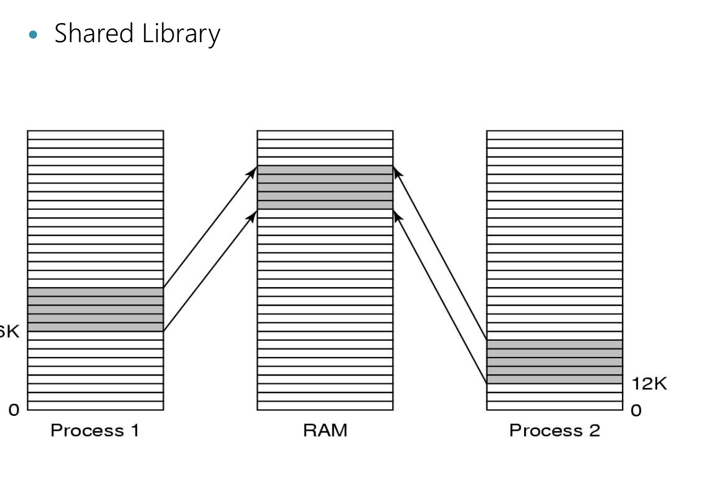

[(36条消息) 操作系统笔记_Blanche117的博客-CSDN博客](https://blog.csdn.net/weixin_45745854/category_11107337.html)

[(31条消息) 西电软工操作系统复习纲要_西电操作系统_西电卢本伟的博客-CSDN博客](https://blog.csdn.net/lbwnbnbnbnbnbnbn/article/details/125643650)

[(31条消息) 操作系统_sandalphon4869的博客-CSDN博客](https://blog.csdn.net/sandalphon4869/category_9561523.html)

### Threads


- 


<center>一个进程中线程的私有项和共享项</center>


# Overview

## OS定义

OS是什么：

- **运行在内核态的软件**
- **是资源管理器**
  - 
- **是扩展机器**
  - 
    意思就是一个通用的PC，就能完成各种服务（银行系统、航空服务、网页浏览），这就是扩展。
- 是用户与系统硬件的接口
  - 联机命令接口（交互式指令）
    就是在命令行里输入的指令，你输一句操作系统给你个反馈，这就是交互
  - 脱机命令接口（批处理指令）
    就是将一堆交互式指令集中到一个批处理文件中，在win10中是`.bat`，在linux中是`.sh`
  - 程序接口（系统调用）
    只能通过应用程序调用，用户不能直接打在命令行，所以是程序接口。
    这就是内核态提供给用户态的接口。
    在win10里就是`.dll`，在linux可以通过`syscall()`函数在程序中调用

## OS structure

- Monolithic庞大的
- Layered分层的
  屏蔽底层细节，提供给上层应用接口
- **Virtual Machine虚拟机**
  **如VM/370，OS/360，CMS(Conversational Monitor System)**
  **用于云计算，web-host云主机**
- client-server客户机服务器
  用于分布式系统（distributed system），分布式计算，并行计算

## Basic Concepts

- Shell

  - Shell是指操作系统提供给用户的一个**命令解释器**，它接收用户的命令，然后将其转换为内核能够执行的指令并执行，同时将执行结果输出给用户。Shell可以**作为用户与操作系统之间的接口**，方便用户使用操作系统提供的各种功能。

- System Calls：“trap into kernel”

  - 为了**从操作系统中获取服务**，用户程序必须使用系统调用以陷入内核并调用操作系统

    `TRAP`指令把用户态切换成内核态，并启用操作系统。

  - 由操作系统实现，提供给应用程序来调用，用以访问内核功能的所有接口的合集

- Process

- File System
  **file system= file + file management**

- IPC

## History

1. 第一代：真空管和穿孔卡片

2. 第二代：晶体管和批处理系统

   - IBM 1401：将卡片读入磁带
   - IBM 7094：完成真正的计算

3. 第三代：集成电路和多道程序设计

   - 多道程序设计：将内存分区，每一部分存放不同的作业。

     当一个作业等待IO完成时，另一个作业可以使用CPU。当作业足够多时，CPU的使用率可以接近100%。

   - SPOOLing技术是一种输入输出技术，任何一个时刻，当一个作业结束时，操作系统就能将一个新作业从磁盘读出
   - 分时系统：多道程序的变体，每个用户都有一个联机终端。系统轮流为各个用户服务。用户的指令较为简短，不会很耗时。
   - MULTICS与云计算
   - 小型机的崛起：IEEE定义了POSIX（可移植操作系统接口）规范，大多数的UNIX版本支持它。POSIX定义了一个凡是UNIX必须支持的小型系统调用接口。**在为不同的操作系统提供一致的API和接口规范，使得应用程序可以在不同的操作系统上进行编译和运行**
     并且提出了MINIX

4. 第四代：个人计算机

5. 第五代：移动计算机

> **不同种类操作系统区别**
>
> **1. Mainframe Operating Systems**
>
> 这些是大型机的操作系统。它们能处理大量的数据，可以同时服务于多个用户。其设计注重稳定性、可靠性、安全性和高效处理大型业务负载。IBM的z/OS就是一个典型的例子。
>
> **2. Server Operating Systems**
>
> 服务器操作系统是专为服务器硬件和软件设计的。它们可以处理更多的并发连接和高级网络协议，并且支持服务器级的硬件配置，包括多个CPU和大量的内存。常见的服务器操作系统有Linux的各种发行版、Windows Server、Unix等。
>
> - **Server Operating System vs Client Operating System**
>
>     服务器操作系统和客户端操作系统的主要区别在于它们的工作方式和目标。**服务器操作系统为多个用户或客户端提供服务，而客户端操作系统则专为单个用户的设备设计。**服务器操作系统能处理大量并发请求和任务，而客户端操作系统通常只需处理用户的输入和输出。
>
> - **Server Operating System vs Mainframe Operating System**
>
>     主要区别在于它们处理的工作负载和使用的硬件。**主机操作系统设计用于大型机，这些机器通常在企业环境中处理大量的业务负载。而服务器操作系统则设计用于网络环境，通常为网络用户提供服务。**
>
> **3. Multiprocessor Operating Systems**
>
> 多处理器操作系统是能够在具有多个处理器的系统上运行的操作系统。这些操作系统可以有效地管理和调度多个处理器，使得任务可以在不同的处理器上并行处理，提高系统的总体性能。**多核心的个人电脑和服务器都使用这类操作系统。**
>
> **4. Personal Computer Operating Systems**
>
> 这类操作系统主要设计用于个人计算机，例如台式机或笔记本电脑。这些操作系统通常具有用户友好的图形用户界面（GUI），并为用户提供各种应用程序和服务。常见的个人电脑操作系统有Windows、macOS和Linux。
>
> **5. Real-Time Operating Systems (RTOS)**
>
> 实时操作系统是一种可以在规定时间内响应外部输入的操作系统。这些系统通常用在需要**精确和快速反应的环境中**，例如航空、工业自动化和高级驾驶辅助系统等领域。
>
> **6. Embedded Operating Systems**
>
> 嵌入式操作系统设计用于嵌入式系统，例如家用电器、汽车、机器人等。这些操作系统通常需要在资源有限的环境下运行，因此它们通常被优化为小巧、高效且能完成特定任务。
>
> **7. Smart Card Operating Systems**
>
> 智能卡操作系统是设计**用于运行在CPU芯片上的微小操作系**统，常常用于信用卡大小的设备中。这些操作系统的功能相当

# Processes and Threads

## Processes

> - process model
>   - What is process? consist of ?
>     程序没有：stack，PCB
>   
>     
> - process creation
>   - four events that cause process creation
>   - parent and children
>     - resource sharing(3 cases), execution(concurrently or not), address space
>     
>     - > 进程创建之后，父进程和子进程有不同的**地址空间**，如果其中某个进程在其地址空间中修改了一个字，这个修改对其他进程而言是不可见的。
>       >
>       > 在UNIX中：
>       >
>       > - 子进程的初始**地址空间**是父进程的一个副本，但是这里涉及两个不同的地址空间，不可写的内存区是共享的。某些UNIX的实现使得程序正文在两者间共享，因为它不能被修改。——完全分离可写和不可写的区域
>       > - 或者，子进程共享父进程的所有内存，但是这种情况下通过**写时复制**共享，这意味着一旦两者之一想要修改部分内存，则这块内存首先被明确的复制，以确保修改发生在私有的内存区域。——写时复制
> - process termination
>   - four conditions that terminate process
>   - In what situation parent may terminate child processes.
> - process state
>   - new, running, blocked, ready, terminated
>   - diagram of process state(important)
>   - when to switch, context switch
> - implementation of process
>   - main: PCB

**正在运行的程序的实例。**

- 创建

  - 系统初始化
  - 正在运行的程序执行了一个创建进程的系统调用
  - 用户请求创建一个新进程
  - 一个批处理作业的初始化

- 终止

  - 正常退出
  - 错误退出
  - 严重错误（非自愿）
  - 被其他进程杀死

- PCB：**进程控制块**。包含寄存器，程序寄存器，程序状态字psw，堆栈指针，堆栈状态，进程ID。每一个进程都对应一个PCB，是进程存在的唯一标志。
  To implement the process model, the operating system maintains a table (an array of structures), called the process table, with one entry per process. (Some authors call these entries process control blocks.

  对应关系：eg：当前目录

  - process manageent
    

### fork()exec()

```cpp
#include <unistd.h>
#include <stdio.h>
int main(){
	pid_t pid;
	pid = fork();//ork( )是由父进程创建一个一模一样的子进程，子进程从fork( )函数结束处开始执行，而父子进程之间执行的先后顺序是随机的
	if(pid == 0)
		printf("生成的子进程\n");
	if(pid > 0)
		printf("父进程\n");	
	return 0;
}
//结果： 生成的子进程\n 父进程（或相反）

#include <unistd.h>
#include <stdio.h>
int main(){
	pid_t pid;
	pid = fork();
	if(pid == 0)
		printf("os exam\n");
	if(pid > 0){
        execl("/bin/ls","ls","-1",0);//exec函数族可以根据指定的文件名或目录名找到可执行文件，并用它来取代原调用进程的数据段、代码段和堆栈段。在执行完后，原调用进程的内容除了进程号外，其它全部被新程序的内容替换了。
        printf("os exam\n");
    }	
	return 0;
}
//结果： os exam


```

> For the program listed below, how many “hello” will be printed? Please explain your answer.： int main() { fork(); printf("hello\n");  execl("/bin/ls","ls","-l",0);  printf("hello\n"); } 用中文回答

### 计算

假设：

- 进程等待I/O**操作的时间与其停留在内存中的时间的比为p**
- 内存中有n个进程
- n个进程都在等待I/O操作的概率是p^n

那么CPU的利用率由下面的公式给出：
C P U 利用率 = 1 − p ^n

## Threads

> - Thread model
>
>   - what is thread? consist of? properties?
>   - what items are shared between threads, what are ***private*** to each other?
>
> - Implementing threads
>
>   - three mechanism(kernel space, user space, hybrid)
>
> - Scheduling
>
>   
>
> 

### Conception

- A thread consist of ==program counter, register set, stack space.==
- A thread share `code section,data section,OS resouces`

1. 什么是线程？线程与进程的区别？

答：线程是轻量级进程。二者区别：**线程有自己的程序计数器，寄存器，堆栈，状态。**可以共享进程的**地址空间**，全局变量，打开文件等。进程是资源的管理者，线程是进程中运行的实体，是cpu的调用者。

2. 什么是用户级线程，什么是内核级线程，其各自的优缺点是什么？

- 切换
- 调度算法
- 阻塞
- 并行

答：**用户级线程 (User-Level Threads)**

用户级线程是完全在用户空间中实现和管理的线程。由于它们不需要内核的帮助来进行线程管理，因此创建、销毁和切换线程的成本相对较低。

*优点：*

1. 上下文切换速度快，因为不需要从用户模式切换到内核模式。
2. 用户可以自定义调度算法，以便更好地满足特定应用程序的需求。

*缺点：*

1. 如果一个用户级线程进行了阻塞操作（例如I/O请求），那么整个进程都会被阻塞，其他线程无法执行，即使它们是就绪的。
2. 用户级线程不能利用多处理器并行，因为内核看到的只是一个单一的、单线程的进程。

**内核级线程 (Kernel-Level Threads)**

内核级线程是由操作系统内核来管理的线程。内核对线程的创建、销毁和切换有完全的控制权。

*优点：*

1. 如果一个线程阻塞（例如等待I/O完成），其他线程还可以继续运行，因为内核可以调度进程内的其他线程。
2. 可以利用多处理器进行并行处理，因为内核可以将不同的线程调度到不同的处理器上运行。

*缺点：*

1. 创建、销毁和切换线程的开销大，因为这些操作需要在用户模式和内核模式之间切换。
2. 内核级线程不容易进行自定义调度，因为调度算法是由内核决定的。


> #### 混合实现(bhui)
>
> 

> ### 弹出式线程
>
> 分布式系统中处理到来的消息：如服务请求。
>
> 传统：将进程与线程阻塞在`receive`系统调用上，等待消息到达。消息到达时，系统调用接收消息。
>
> 弹出式线程：一个消息的到达导致创建一个处理该消息的线程。好处是线程新，没有历史，可以快速创建。消息的到达和处理时间非常短。

> ### POSIX线程
>
> 移植
>
> IEEE定义了线程的标准。定义的线程包叫做`pthread`。大部分UNIX支持该标准。
>
> 所有`pthread`线程都有某些特性。每一个都有一个标识符，一组寄存器和一组存储在结构中的属性。这些属性包括堆栈大小、调度参数以及其他线程需要的项目。


## IPC

### 概念❤

1. 竞争条件 Race condition：两个或多个进程读写某些共享数据，而最后的结果取决于进程运行的精确时序。

2. 互斥 mutual exclusion：以某种手段确保，当一个进程在使用共享变量或文件时，其他进程不能进行同样操作。

3. ==四种解决互斥的方案==four conditions to hold to have a good solution for race condition/mutual exclusion：

   - 任何两个进程不能同时处于临界区
   - 不应对CPU的速度和数量作出假设
   - 临界区外运行的进程不能阻塞其他进程
   - 不能使进程无期限等待进入临界区

   > 1. **任何两个进程不能同时处于临界区：** 这个条件是确保任何时候**只有一个进程能访问共享资源，防止发生冲突**。如果允许多个进程同时进入临界区并访问或修改同一资源，就会导致数据不一致，也就是我们常说的竞态条件。
   >
   > 2. **不应对CPU的速度和数量作出假设：** 这个条件是为了**保证算法的普适性和公平性**。如果解决方案依赖于CPU的速度或者数量，那么在不同的硬件环境下，这个方案可能就不能工作。此外，**如果快的进程总是能优先进入临界区，那么慢的进程可能就会饿死**。
   >
   > 3. **临界区外运行的进程不能阻塞其他进程：** 这个条件是为了**保证系统的效率。**如果一个进程在临界区外部运行时阻塞了其他进程，那么这个进程就成为了系统的瓶颈，大大降低了系统的运行效率。
   >
   > 4. **不能使进程无期限等待进入临界区：** 这个条件是为了**防止发生死锁和饥饿**。如果有进程一直等待进入临界区而得不到服务，那么这个进程就可能陷入无期限的等待，无法进行下去，这就是我们常说的饥饿。如果多个进程互相等待对方释放资源，那么就可能发生死锁。
   >
   > 满足这四个条件的解决方案可以有效地解决竞态条件，保证了进程间的互斥访问临界区，提高了系统的稳定性和效率。

4. 临界区 critical region：对共享内存进行访问的**程序片段**称为临界区。

5. 自旋锁 spin lock：用于忙等待，也叫忙等锁（busy-waiting lock）

6. 管程：是一个由过程，变量，数据结构组成的一个集合。进程只能通过访问管程中的过程来访问过程中的数据结构。

   管程是一个由过程、变量和数据结构等组成的一个集合,它们组成一个特殊的模块或软进程可在任何需要的时候调用管程中的过程，但它们不能在管程之外声明的过程中直接访问管程内的数据结构。
   任一时刻管程中只能有一个活跃进程，这一特性使管程能有效地完成互斥。


1. 自旋锁和信号量的区别？信号量和互斥量的区别？

答：自旋锁是自选等待，用于忙等待，对系统负载大，浪费cpu时间，效率较高，是关抢占的；信号量是睡眠等待，对系统消耗小，因为进行了进程间的切换效率较低，没有关抢占。

信号量的值是0或者正数，而互斥量的值只能是0或者1；信号量一般是实现在内核态的，而互斥量是实现在用户态的。

> 信号量和互斥量都是线程同步机制，用于确保对共享资源的互斥访问。它们的最大区别在于使用方式和功能。
>
> 1. 使用方式
>
> 信号量可以是计数型的或二元（0或1）型的。计数型信号量维护一个计数器，线程可以对该计数器进行加减操作。二元信号量只有0和1两种状态，线程只能对它进行加1或减1操作。
>
> 互斥量只有两种状态：锁定和未锁定。当一个线程获取互斥量时，如果该互斥量已经被其他线程占用，则该线程会被阻塞，直到该互斥量被释放。
>
> 2. 功能
>
> 信号量可以用于解决多个线程之间的同步问题，如生产者-消费者问题、读者-写者问题等。信号量可以允许多个线程同时访问共享资源，只需要控制访问的数量即可。
>
> 互斥量主要用于解决对共享资源的互斥访问问题。互斥量只允许一个线程访问共享资源，其他线程必须等待该线程释放互斥量后才能继续访问共享资源。
>
> 3. 应用场景
>
> 计数型信号量适用于控制多个线程对一组资源的访问，例如线程池中的线程数控制。
>
> 二元信号量适用于控制两个线程之间的同步，例如控制读写锁的写优先级。
>
> 互斥量适用于对共享资源的互斥访问控制，例如文件访问。互斥量可以确保在任何时候只有一个线程访问共享资源，避免了数据竞争问题的发生。
>
> 总的来说，信号量和互斥量是两种不同的线程同步机制，它们的选择取决于具体的应用场景和需求。

> **消息传递**是机器间的信息交换方法。这种进程间通信方法使用两条原语：`send`和`receive`。`send(destination,&message)`：向一个给定的目标发送消息
>
> 和`receive(source,&message)`：从一个源接收一个消息。
>
> 如果没有消息可用，则接收者可能被阻塞，直到一条消息到达，或者带着一个错误码返回。(bukao)
>
> #### 消息传递系统的设计要点
>
> 区分新老消息：序号
>
> 消息丢失：发送确认

### 代码

实现

> 优缺点

经典IPC

## Scheduling

> ## 调度
>
> **何时调度：**
>
> - 创建一个新进程后：运行父进程or子进程
> - 在一个进程退出后
> - 当一个进程阻塞在I/O和信号量上，或者因为其他原因阻塞时
> - 当一个I/O中断发生时
>
> 两种调度算法：
>
> - 非抢占式调度：挑选一个进程运行，直到该**进程被阻塞或者自动放弃CPU**
> - 抢占式调度：挑选一个进程，**并且让进程运行至某个固定时间段的最大值。**如果该时间段结束时，进程仍在运行，他就被挂起，调度程序选择另一个进程运行。
>
> 时间
>
> - 到达时刻Arriving time
> - 花费时间Burst time
> - 开始时刻
> - 完成时刻
> - 响应时间Respone time：开始时刻-到达时刻
> - 周转时间Turnaround time：完成时刻-到达时刻
>
> > 吞吐量throughput：每小时完成的作业数量
> >
> > 周转时间：从一个批处理作业提价到完成时刻为止的统计平均时间。该数据度量了用户得到输出所需的平均等待时间
> >
> > 响应时间：发出命令到得到响应的时间
> >
> > (画甘特图)


> 批处理系统：
>
> - 先来先服务 FCFS(first come first service)：先到先得
> - 最短作业优先 SJF(Shortest Job First)：可抢占式就是来的那一刻打断（不是时时刻刻都能打断），非抢占式就是得完成再打断。
> - 最短剩余时间
>
> 交互式系统调度
>
> - 时间片轮转 Round-Robin：完成人物则可以提前结束时间片
> - 高响应比优先调度算法 HRRN：每次都要计算响应比
>   
> - 多级反馈队列调度 Multiple Queue：外部优先级是按照队列的层次优先级，内部优先级是按照队列内部列的自己的优先级。


①long-term schedule（长期调度，又称**作业调度**）：
哪个程序被系统选中并创建进程运行它
②medium-term schedule（中期调度，又称**内存调度**）：
决定是否将进程调入内存
③short-term schedule（短期调度，又称**CPU调度**）：
哪个进程获得处理器资源（通常所说的调度）


#### 实时系统中的调度realtime

实时系统是一种时间起着主导作用的系统。

实时系统通常可以分为硬实时和软实时：

- 硬实时：必须满足绝对的截止时间
- 软实时：虽然不希望偶尔错失截止时间，但可以容忍

> **实时系统（Real-Time System）**
>
> 实时系统是指在规定的时间内必须完成特定任务的系统。在这种系统中，结果的正确性取决于计算结果以及结果产生的时间，即使计算结果正确，如果未在规定的时间内产生，也被视为错误。
>
> 实时系统可以进一步被分为硬实时系统和软实时系统：
>
> **硬实时系统（Hard Real-Time System）**
>
> 硬实时系统要求必须在确定的截止时间之前完成任务。对于这类系统来说，如果未能在截止时间前完成任务，就会导致严重的后果，甚至可能是灾难性的。例如，飞机的航空控制系统，汽车的防抱死制动系统，如果没有在规定的时间内完成任务，就可能导致生命危险。
>
> **软实时系统（Soft Real-Time System）**
>
> 软实时系统对时间的要求相对宽松一些。如果任务偶尔未能在截止时间前完成，系统仍然可以继续运行，只是可能会导致性能下降，但不会引发灾难性的后果。例如，视频播放器就是一种典型的软实时系统，如果偶尔丢帧或者延迟，只会导致画面质量下降，但不会影响到整个系统的运行。
>
> 总的来说，实时系统是一种对时间有严格要求的系统，硬实时系统和软实时系统的区别主要在于对时间限制的宽松程度和违反时间限制的后果。

# Memory Management

为什么要内存管理：

最简单的存储器抽象就是没有存储器抽象，每一个程序都**直接访问物理内存**。

这种情况下，想要在内存中同时运行两个程序是不可能的，一个程序会擦除另一个程序在相同位置的所有内容。


**static relocation & dynamic relocation**

静态重定位：用户程序加载到内存时，一次性实现逻辑地址到物理地址的转化。把作业装入内存时的地址变化。当一个程序装载到地址x时，常数x被加到每一个程序地址上。

动态重定位：在逐条指令执行时，完成地址转换。在装载时无需重定位。


**程序的起始地址加载到基址寄存器中，程序的长度装载到界限寄存器中**。

> **静态重定位 (Static Relocation)**
>
> 静态重定位是在程序加载到内存之前进行的。这个过程中，程序中的每个相对地址（或称为重定位地址）都会加上一个常数（程序在内存中的起始地址），从而得到实际的物理地址。
>
> 静态重定位的主要优点是其简单和执行时的效率，因为所有的地址转换工作都在加载程序的时候完成，执行时不需要进行地址转换。
>
> 然而，它的主要缺点是一旦程序加载到内存，其位置就不能再改变，这限制了多任务和虚拟内存等特性的实现。
>
> **动态重定位 (Dynamic Relocation)**
>
> 动态重定位是在程序执行期间进行的。这个过程中，程序的地址被存储为相对于某个基址（即程序在内存中的起始地址）的偏移量。每当程序需要访问一个地址，都会动态地将这个偏移量加上基址，得到实际的物理地址。
>
> 动态重定位的主要优点是灵活性，因为程序的位置可以在执行期间改变，这使得操作系统可以更好地管理内存，实现多任务和虚拟内存等特性。
>
> 然而，它的主要缺点是执行时的效率，因为每次地址访问都需要进行地址转换。
>
> 总的来说，静态重定位和动态重定位都是地址转换的方法，它们分别适用于不同的场合。静态重定位适用于单任务环境和对效率要求很高的情况，而动态重定位适用于多任务环境和对内存管理要求很高的情况。

### 交换技术

> 处理内存超载的方法：
> { 交换技术 虚拟内存
>
> 
>
> 程序换入换出需要使用界限寄存器。
>
> 可能出现内存空洞：需要内存紧缩。
>
> **内存分配算法**

## virtual memory

**The basic idea behind virtual memory is that the combined size of the program, data, and stack may exceed the amount of physical memory available for it.**

**The operating system keeps those parts of the program currently in use in main memory, and the rest on the disk.**

> 虚拟内存。
> 虚拟内存背后的基本思想是，程序、数据和堆栈的大小之和可能超过可供其使用的物理内存量。
> 操作系统将当前正在使用的程序部分保存在主内存中，其余部分保存在磁盘上

### paging

> - MMU
> - How do we convert virtual address to physical memory address? (Usage of MMU)
>
> 
>
> - **What is page, page frame, page fault?**
>
>   - **The virtual address space is divided up into units called pages.**
>   - **The corresponding units in the physical memory are called page frames.**
>   - **When MMU notices that the page is unmapped  and causes the CPU to trap to the operating system. This trap is called a page fault**
>
> - How is page table used ?
>
>   
>
> - Page table entry
>
>   
>
> - **页表项的结构**
>   不同计算机的页表项大小可能不一样，但是32位是一个常用的大小。
>
>   **页框号**
>   最重要的就是页框号。
>   将此帧号与虚拟地址的偏移量（Offset）结合，可以得到完整的物理地址。
>
>   **在/不在**
>   其次是“在/不在”位。这一位是1时，表示可以使用；如果是0，访问该页面会引起一个缺页中断。
>
>   **保护位**
>   允许什么类型的访问：0表示读/写，1表示只读
>   例如，有些页可能被标记为只读，尝试写入这些页将触发异常。
>
>   **修改位**
>   重新分配页框时十分有用。如果一个页面已经被修改过，那么必须把他写回磁盘。如果一个页面没有被修改过，那么只需要简单的将其丢弃。
>
>   **访问位reference**
>   它的值适合用来帮助操作系统在发生缺页中断时选择要淘汰的页面。不再使用的页面要比正在使用的页面更适合淘汰。
>
> > 是否允许页面被硬件缓存通常由操作系统或硬件驱动程序在设置页表项时确定。这取决于该页面的用途和性质。
> >
> > **什么情况下可以缓存：**
> >
> > 大部分的内存页面都可以被缓存。处理器可以将这些页面中的数据加载到缓存中，从而提高其访问速度。当CPU再次访问相同的内存地址时，如果数据已经在缓存中，就可以直接从缓存中读取，避免了访问慢速的主内存。这种情况适用于大部分的代码和数据。
> >
> > **什么情况下不可以缓存：**
> >
> > 某些特殊的内存页面不能被缓存。这通常包括内存映射的硬件设备（Memory-mapped I/O devices）的页面。这是因为这些设备的状态可能会在没有CPU干预的情况下改变。例如，一个网络适配器可能会在接收到新数据时更新其内存状态。如果CPU将这些内存区域的内容缓存起来，那么它看到的将是过时的状态信息，这将导致错误。因此，对于这些内存映射的设备，通常会在页表项中禁用缓存。
> >
> > 其他一些可能需要禁用缓存的情况还包括一些特定的性能优化场景，以及需要精确控制内存访问时间的场景（例如实时系统）。

1. MMU：memory management unit内存管理单元，虚拟地址被送到MMU，MMU将虚拟地址映射为物理地址

2. Page Table：页表的目的就是将虚拟页面映射成页框。页表由页表项构成。实际内存的每个页框对应了一个表项，而不是每个虚拟页面对应一个表项。

3. Paging：虚拟地址空间按照固定大小分为被称为页面（page）的若干单元。在物理内存中对应的单元称为页框（page frame）。页面和页框的大小通常是一样的。

4. **TLB：Translation Looked aside buffer转换检测缓冲区，又叫快表。**

   计算机的一个小型硬件设备**，将虚拟地址直接映射到物理地址**，不需要再访问页表，通常在MMU中，包含少量的表项。当虚拟地址放入MMU中时，首先通过硬件在TLB中将虚拟页号与TLB中所有表项进行同时匹配，如果有效匹配，则取出页框号，不用访问页表。如果虚拟页号不在TLB中，MMU就会进行正常的页表查找，并且替换TLB 的表项。

   > TLB软件管理：
   > 当一个页面访问在内存中不在TLB中时产生软失效（soft miss）更新一下TLB
   >
   > 当页面也不在内存中，产生硬失效（hard miss）

5. When MMU notices that the page is unmapped  and causes the CPU to trap to the operating system. This trap is called a **page fault**
   MMU注意到程序引用了一部分不在物理内存中的地址，于是CPU陷入到操作系统，这个陷阱称为缺页中断或者缺页错误

###  加速分页过程

分页系统中的两个问题：

- 虚拟地址到物理地址的映射必须非常快
- 如果虚拟地址空间很大，页表也会很大

（1）映射快慢的问题：TLB

（2）页表过大的问题
多级页表（Multilevel Page Table：级别越大，灵活性越高。但超过三级更复杂；

倒排页表；（Inverted PageTables）：每一个页框有一个表项，而不是前面的每一个虚拟页面有一个表项。但地址转换更复杂了。

### 系统设计

#### Page Fault Reducing

Solution:

- 局部替换/全局替换
- If use Global one, PFF can be used to
  further reduce page fault.
  ◦ PFF(Page Fault Frequency)

- 抖动（Trashing）
  - Reduce number of processes competing for
    memory
  - swap one or more to disk, divide up pages they
    held
- Clean Policy
  -  Insure enough free pages to use, i.e 未雨
    绸缪，不等到内存脏页满了才将脏页刷到
    磁盘上

#### Reduce Waste of Space

Page Size
◦ Small page size
Advantages
less internal fragmentation
better fit for various data structures, code sections
less unused program in memory
◦ Disadvantages
 programs need many pages, larger page
tables

##### 计算最优页面大小

额外开销overhead


- s : 平均进程大小
- p : 页的大小  

- e ： 一个页表项的大小

（粗略多级页表）S/P(页数)*E：页表大小，P/2(没占满)

可得极值【P = 】

#### 共享内存


共享库：共享的一段代码

地址：相对地址和绝对地址

编译时翻译为相对地址



页表。进程


1. Memory mapped files：进程通过一个系统调用(mmap)，将一个文件映射到其虚拟地址空间的一部分。对文件的读写，就像内存中的字符数组，而不用通过读写来访问文件。（这个考了）
   编程简单、速度（buffer）
2. DLL：shared library，dynamic linked libraries 共享库又称动态链接库，当一个程序和一个共享库链接时，连接器并没有加载所有的函数，有的函数只是加载了一段能在运行时绑定被调用函数的存根历程。当一个共享库被装载和使用时，整个库并不是一次性并装入内存。而是根据需要，以页面为单位装载的，没有被调用的函数是不会被装入内存的。（这个考了）
3. Shared Pages:进程实用相同的 i 空间页表。

- virtual memory Interface 便于用户查看状态

#### Implementation Issue

- **Time for paging**

When Paging subsystem begins to work?
◦ Process creation生成
 determine program size
 create page table
◦ Process execution执行
 MMU reset for new process
 TLB flushed
◦ Page fault time缺页中断
 determine virtual address causing fault
 swap target page out, needed page in
◦ Process termination time进程退出
 release page table, pages释放

- **Page Fault Handling--Instruction Backup**

  - TSL原子性
  - 普通中断，处理后执行下一条指令
  - pageFault，从发生出开始

- **Locking Pages in Memory**

  不能被交换

  ◦ Virtual memory and I/O occasionally interact
  ◦ Proc issues call for read from device into
  buffer
   while waiting for I/O, another processes starts up
   has a page fault(传感器覆盖)
   buffer for the first proc may be chosen to be
  paged out
  ◦ Need to specify some pages locked
   exempted from being target pages

- Comparison of paging and segmentation


- Segmentation with Paging: MULTICS

段页式翻译

先翻虚地址


### 计算

**页面置换算法**

OPT（将以后最少使用的替换）、FIFO、LRU（未使用时间最长）

**内存动态分区分配**

首次适应、最好适应、最坏适应、领近适应，


# File System

解决问题：提供新的抽象——文件。

**文件**：进程创建的信息逻辑单元


### 一. 文件系统的实现

1. hard link & soft link

 硬链接：两个文件目录指向一个inode；磁盘块不列入目录，列入目录的是i节点

> 磁盘块不列入目录，而是列入i节点，**目录指向i节点**。
>
> 缺点：B链接到共享文件时，i节点的所有者是C。
>
> 建立一个连接不会改变所有关系。只是将i节点的链接数+1，OS知道目前有多少个目录指向这个文件。
>
> **C以后试图删除时，如果系统删除文件并清除i节点，B有一个无效的i节点，后续可能发生错误。**
>
> 唯一做法是删除C的目录项，但保存i节点，i节点链接数-1。但所有者仍是C，C为B付账，直到计数为0，被删除。

软连接：符号链接，创建一个链接文件link，文件内容为要共享的文件的路径，把该文件放在B的目录下，只有**真正的文件拥有者才拥有者真正的Inode**。

> 系统建立一个Link类型的新文件。把文件放在B的目录下，是的B与C的一个文件存在链接。
>
> Link中只有它所连接文件的路径名。
>
> OS通过路径名找文件。
>
> 符号链接没有上述的i节点法的问题。连接到B的只有路径，没有i节点。文件和i节点删除时，试图通过该链接访问将失败。
>
> 符号链接的缺点：
>
> - 由路径搜寻需要开销。额外磁盘消耗。

1. FAT作用

 FAT表：取出每个磁盘块的指针字，放到内存的一个表中。
​ 作用：整个块都可以存放数据（不用第一个字放指针），随机访问也变容易了）。只要目录项中记录一个整数，按照它可以找到文件的所有块。

- 分配
- 追踪

1. inode：最后一个记录了各个文件分别包含哪些磁盘块的方式是给每个文件赋予一个称为 i 节点的数据结构，其中列出了文件属性和文件块的磁盘地址。给定 i 节点，就能找到文件的所有块。
2. **inode相较于FAT的优势：只有在文件打开时，i 节点才在内存中，为了打开文件而保留 i 节点的数组所占据的空间比FAT表要小得多。（今年考了）**

> FAT（File Allocation Table）和i-node是两种常见的文件系统设计方案。
>
> FAT是一个基于磁盘分区的文件系统，被广泛应用于DOS和Windows操作系统。它使用表格来映射磁盘上的文件和空闲块，每个文件都被分成多个簇（cluster），并且在FAT表中标记出每个文件簇的状态和位置。FAT的优点是简单、易于实现和维护，支持跨平台访问，因此它在一些移动设备上得到了广泛的应用。缺点是对于大容量的硬盘，簇大小的限制会导致空间浪费和碎片化问题，性能不如其他文件系统。
>
> i-node则是一种基于索引节点（index node）的文件系统设计方案，被广泛应用于类Unix操作系统。它将文件的元数据信息与文件数据分离存储，使用索引节点来记录文件的元数据信息和数据块的位置，同时支持硬链接、软链接等功能。i-node的优点是可以有效地管理大容量硬盘，提高文件系统的性能和可靠性，同时支持硬链接、软链接等高级特性；缺点是相对比较复杂，实现和维护成本较高。
>
> 综上所述，FAT适用于一些需要简单、稳定的移动设备，而i-node适用于大型、高性能的文件系统，如服务器上的存储系统。选择哪种文件系统设计方案最终取决于应用场景和需求的具体情况。


> ### 文件系统布局
>
> 磁盘分区—>>每个分区中有独立文件系统。
>
> **主引导记录**（Master Boot Record, MBR）：磁盘的0号扇区，用来引导计算机。MBR末尾是分区表。
>
> 分区表：给出了每个分区的起始和结束地址。表中的一个分区被标记为活动分区。
>
> 计算机被引导时BIOS读入并执行MBR。MBR确定活动分区。读入MBR的第一个块：引导块。
>
> 文件系统含有的项目：
> 
>
> - 引导块
>
>   引导块中程序装载该分区中的操作系统。每一个分区从一个引导块开始。
>
> - 超级块
>
>   典型信息：魔数，文件系统中的块数量，管理信息
>
> - 空闲内存管理
>
>   空闲块的信息：用位图或者指针列表给出。
>
> - i节点
>
> - 根目录
>
> - 文件和目录

### 二. 实现

1. LFS：把磁盘当成一个大的循环使用的Log，每次 都是从当前位置连续向后写，写到末尾，再返回从头 开始向后写，这样就可大大降低寻道时间。所有的写操作最初都被缓冲在内存中，然后周期性的把已缓冲的写作为一个单独的段，在日志的末尾写入磁盘。要打开一个文件，则首先需要在i节点图中找到文件i节点。一旦文件定位后就可以找到相应的块的地址。
2. Journaling File System:保存一个用于记录系统下一步要做什么的日志。
3. VFS：将多种的文件系统统一成一个有序的结构。**抽象出所有文件系统的共有部分，并将这部分代码放在单独的一层**，该层调用底层的实际文件系统来管理数据。

> Log File System是以日志方式组织文件系统的数据结构，它在进行文件操作时，会将操作记录到一个日志中，然后用一定策略批量地将这些操作应用到文件系统的数据结构中，以此来保证文件系统的一致性和高效性。Log File System最大的优点在于它可以快速地恢复文件系统，因为它有一个事务日志记录所有的文件修改操作，如果出现故障需要重建文件系统，则只需要读取并应用这个日志即可。另外，在进行文件创建、写入、删除等操作时，Log File System较其他文件系统更快，因为它会先记录在日志中，而不是直接更新文件系统节点，这样减少了磁盘操作次数，提升了性能。缺点则是由于需要维护日志，所以会增加一定的开销。
>
> Virtual File System是一个抽象层，它为不同类型的文件系统提供了一个统一的接口，使得不同类型的文件系统可以透明地应用于同一台计算机上，即使使用的硬件和操作系统不同。通过为每个文件系统类型定义一组VFS操作，Virtual File System可以隐藏不同文件系统的差异性，使得上层应用程序对所有文件系统的访问变得一致、可靠、安全。缺点是由于需要进行额外的访问控制和文件系统转换操作，所以会增加一定的开销。
>
> 综上，Log File System在恢复速度和写入性能方面具有优势，而Virtual File System则可以为不同类型的文件系统提供一个统一的接口。实际使用中，应该根据应用场景和需求进行选择。
>
> Journaling File System（日志文件系统）是一种在文件系统中使用日志来跟踪数据修改的技术。和Log File System类似，它也会记录所有操作到一个事务日志中，并将这些操作应用到文件系统的数据结构中，以此来保证文件系统的一致性和高效性。
>
> Journaling File System的优点在于它可以快速地恢复文件系统，因为它有一个事务日志记录所有的文件修改操作，如果出现故障需要重建文件系统，则只需要读取并应用这个日志即可。此外，它还可以提高文件系统的性能，减少文件碎片和数据损坏的风险。
>
> Journaling File System相较于Log File System来说，它能够更快地恢复文件系统，因为Journaling File System使用了更加高级的日志记录技术，可以在记录文件更新操作时，还记录影响到的文件系统元素的状态，从而可以避免与现有文件系统状态不一致的情况。缺点则是由于需要维护日志，所以会增加一定的开销。
>
> 总之，Journaling File System是一种高效、可靠的文件系统技术，可以确保文件系统的数据不丢失或者被破坏，并且能够快速地恢复文件系统的状态，因此常被应用于高要求义务的生产环境中。

1. For quota list, why it limits the number of files？

实施文件系统配额的目的是控制存储资源的分配，防止单个用户或组使用过多的存储空间。限制可以存储的文件数量是实现这一目标的一种方法。

当没有配额时，用户可以继续创建新文件，直到存储容量耗尽。这可能会导致性能问题，并可能导致系统崩溃。通过强制用户更有效地管理其存储使用情况，对用户可以创建的文件数量设置限制有助于防止这些问题。

通过限制可以存储的文件数量，它鼓励用户仔细考虑哪些文件是真正必要的，并避免创建不必要或重复的文件。这有助于降低存储成本并提高系统性能。


### 三.优化

- Considerations about Backup(备份)
   Logical Dump or Physical Dump?
  ◦ Physical Dump: starts at block 0 of the disk, writes all
  the disk blocks onto the output tape in order
   Problem1: backing up unused disk block
   Problem2: dumping bad blocks
   Advantages：simplicity and great speed (basically, it can run
  at the speed of the disk).
   Disadvantages ：the inability to skip selected directories,
  make incremental dumps
  ◦ logical dump starts at one or more specified
  directories and recursively dumps all files and
  directories found there that have changed since
  some given base date

逻辑备份：显示的文件拷贝（U盘）看到逻辑结构

物理备份：不管结构，从山区所有视为大文件（光盘）MBR控制信息（快

- File system Performance
   Cache内存中开辟一块空间（不一致）需要立刷
   Block Read Ahead 预读块
   Reducing Disk Arm Motion减少磁盘移动


- The UNIX V7 File System
   A UNIX V7 directory entry.

  2^16(最多存储)


## Input and Output

### I/O

> - DMA (important)
>
>   
> 
> - interrupt
>
> - I/O software
>
>   - Goals: device independence, uniform naming, error handling, syn & asyn transfer, buffering, sharable & dedicated
> 
> - Three ways to perform I/O (important, pay attention to pro&cons)
> 
>   - programed I/O
>   - interrupt-driven I/O
>  - I/O using DMA
> 
>- I/O software layers
> 
>   


1. Memory-Mapped I/O definition：内存映射IO,将所有控制器映射到内存空间中，每个控制器被分配唯一的一个内存地址，并且不会有内存被分配这个地址。这样的系统称为内存映射I/O。

2. Programmed I/O &Interrupted-Driven I/O &DMA I/O difference

   这一章讲的不深，最重要的也就这个知识点了，年年考

   Programmed I/O：CPU一直检查外设

   Interrupted-Driven I/O：允许CPU在等待外设的时候，做些其他的事情，使用中断机制，中断发生在每个字符上。

   IO using DMA：每个缓冲区中断一次，CPU可以自由在IO期间做其他事情。数据传输由DMA在内存和I/O中完成。

低级格式化和高级格式化是两种不同的磁盘格式化方式，它们的区别主要在于对磁盘进行初始化的程度不同。

低级格式化是指将磁盘表面上的所有扇区都清空，这意味着磁盘上的所有数据都被删除，并且所有扇区的标记被重置为初始状态。低级格式化通常由磁盘生产商在出厂时进行，目的是将磁盘恢复到初始状态以便后续的使用。低级格式化只初始化扇区，并没有初始化其它文件系统所需要的数据结构，因此磁盘被低级格式化后，需要通过高级格式化才能使用。

高级格式化是在低级格式化的基础上，对磁盘进行更加深入的操作。它不仅初始化了每个扇区，还会创建并初始化文件系统所需的额外数据结构，如boot block和空闲块管理等。这些数据结构包括文件系统的元数据以及磁盘上存储的用户数据，使得文件系统能够有效地组织数据并提供快速访问。高级格式化通常由操作系统提供的格式化工具完成。

在实际应用中，低级格式化通常不会经常使用，而高级格式化是格式化磁盘的主要方式。在高级格式化时，操作系统会根据具体的文件系统类型和选项设置来创建文件系统所需的元数据和数据结构，以及确定扇区大小、簇大小等参数，从而保证文件系统能够更加有效地管理磁盘上的数据。

总体上来说，低级格式化和高级格式化是两个连续的过程，前者是对磁盘进行初始化，而后者则是建立并初始化文件系统。

# Deadlock

> - Definition and types of resource 
> - Deadlock 
>   - definition 定义
>   - four conditions for deadlock 
>   - strategies dealing with deadlock 
>     - esp. detection and recovery 
> - Recovery from deadlock 
>   - preemption, rollback, killing processes
> - Deadlock avoidance
>   - safe state, Banker's Algorithm
> - Deadlock prevention
>   - attacking four conditions for deadlock
> - Starvation

1. Deadlock：如果一个进程集合中的每一个进程都在等待只能由该进程集合中的其他进程才能引发的事件，那么该进程集合就是死锁的。
2. 四个死锁必要条件及解决方案

- 互斥条件：将临界资源改造为可共享使用的资源，如spooling技术
- 占有并等待：运行前分配好所有需要的资源，之后一直保持
- 不可抢占条件：申请的资源得不到满足时，立即释放拥有的所有资源；申请的资源被其他进程占用时，由操作系统协作剥夺
- 环路等待：给资源编号，必须按照编号从小到大的顺序申请资源

1. safe state：没有死锁发生，即使每一个进程突然请求对资源的最大需求，也可能存在某种调度次序能够使每一个进程运行完毕。
2. Unsafe state：从安全状态出发，系统能保证所有的进程都能完成，从不安全状态出发，就没有这样的保证。

安全状态不一定一定不会发生死锁。不安全状态也不ccc代表当前状态就是死锁状态，当前状态也可能是非死锁，但继续向下运行，一定发生死锁。

1. 银行家算法：你懂的，必考，也不难


# 多处理机

1. 每个CPU有自己的操作系统

优点：每个CPU可以独立运行不同的应用程序，并且可以提高系统的可靠性，当某个CPU崩溃时，其他CPU仍然可以正常运行。

缺点：需要复制多个操作系统内核及其资源，占用的空间较大；需要保持各个CPU之间的同步，增加了开发和维护的难度；没有良好的资源共享机制，导致资源分配不均衡，系统利用率不高。

1. 主从多处理机

优点：具有良好的任务划分和资源共享机制，可以实现高效的负载均衡，系统利用率较高；集中管理、容易维护。

缺点：主节点成为整个系统的瓶颈，当主节点崩溃时，整个系统将停止工作，可靠性低；受限于主节点的运算能力和存储容量，不能适应高负载需求。

1. 对称多处理机

优点：所有CPU都能平等地访问系统中的资源，可以有效地实现任务的协同处理，并具有良好的可扩展性。

缺点：需要具备快速高效的同步与互斥机制，否则容易导致竞争冲突和死锁；由于所有CPU共享系统资源，数据总线和内存带宽等也可能成为整个系统的瓶颈。

综上所述，选择何种多处理机架构类型应该根据具体系统需求和特点来进行选择。对于任务相对简单，资源分配均衡的场景，每个CPU有自己的操作系统比较适用；而在需要高效共享资源和处理高负载的情况下，主从多处理机或对称多处理机更具有优势。


type1 2


## 安全

非对称加密和对称加密是两种广泛应用于数据加密传输领域的不同加密方式，它们的主要区别如下：

1. 加密算法

对称加密使用的是同一个秘钥来加密和解密数据，而且在加密和解密的过程中使用的是同一个加密算法，因此被称为对称加密。

非对称加密则使用了一对密钥，一把公钥和一把私钥。公钥可以公开给所有人使用，私钥则只有掌握的人才能使用。发送方使用接收方的公钥对数据进行加密，接收方再使用自己的私钥对数据进行解密。

1. 安全性

对称加密的安全性取决于秘钥的保密程度。如果密钥被泄露，那么加密的数据也就不再安全。因此，在对称加密中，秘钥的分发和保护都是需要谨慎处理的问题。

非对称加密的安全性相对较高，由于公钥可以公开，因此在信息传输的过程中并不需要共享私钥，也就避免了秘钥管理和保护的问题。

1. 处理速度

对称加密的加解密速度通常比非对称加密快得多，因为对称加密使用的是同一个秘钥和加密算法，而非对称加密需要使用复杂的数学运算来实现安全性。

1. 应用场景

对称加密适用于密钥分发困难的场景，比如加密本地文件、邮件等简单数据传输场景。

非对称加密则通常被用于在线支付、身份认证、数字签名等安全性要求高的场景。

综上所述，对称加密和非对称加密在不同的加密场景中都有自己的应用优势。正确选择合适的加密方式可以保护数据的安全性和保密性，实现更加安全的信息传输。

Problem：通过Signature确保Original Document没有被篡改
Private Key 加密Original Document 的MD5值
Public Key解密Signature，得到MD5的值


自主访问控制（DAC）是指操作系统允许用户自己决定哪些用户可以读取、写入他们的文件和对象，也就是授权由资源的所有者自行决定。在这种访问控制模型中，每个用户都有对其文件或目录进行的控制权限，并可以授权给其他用户或组。虽然DAC可以更灵活地处理实现细节，但是缺点也显而易见：安全性易受到用户错误配置和攻击的影响，因此，在高度敏感的环境下，一些组织采用MAC。

强制访问控制（MAC）是一种更为严格的访问控制机制，它是由操作系统的管理员通过设置访问规则并强制执行来控制应用程序和系统用户的访问的。MAC的授权是由系统管理员配置的，用户不具备修改访问规则和控制安全策略的权限。MAC允许用户对资源进行更细粒度的控制，确保数据安全。多级安全属于MAC的一种实现方式，可以实现多个用户或者系统之间的完全隔离。每个用户分配一个唯一的安全级别（SL），操作系统会根据SL来控制他们能够访问的信息和资源，确保高级别的用户无法访问低级别用户的资源。

## Essay questions prediction

> - ***What is TLB, what role does it play in memory management?*** （往年题）
>
>   - TLB is translation lookaside buffer, a small hardware device for mapping virtual addresses to physical addresses without going through the page table. It's usually inside the MMU and consists of a small number of  entries containing information about the page, like virtual page number, modification bit, protection bit, reference bit and so on.
>   - In memory management, it speeds up paging(mapping virtual addresses to physical addresses).
>
> - What is system call? Use an example to illustrate the steps of system call. （往年题）
>
>   - System call is an interface between a process and operating system to allow user-level processes to request kernel services from the operating system.
>
>   - Example: the system call read(fd, buffer, nbytes).
>
>     1. Push the parameters onto the stack. (In the order of nbytes, &buffer, fd).
>     2. Call library procedure.
>     3. Library procedure put the system-call number in the register.
>     4. ***Execute a TRAP instruction to switch from user mode to kernel mode (and start execution within the kernel).***
>     5. (Examine the system-call number and) dispatch to the correct system-call handler.
>     6. System-call handler runs.
>     7. ***Control return to user-space library procedure (following the TRAP instruction).***
>     8. Procedure returns to the user program like usual procedure calls.
>     9. Clean up the stack and increment SP(Stack pointer).     
>
> - What is monitor? Can you use monitor to implement a data structure? （往年题）
>
>   - **A monitor** is a collection of procedures, variables, and data structures that are all grouped together in a special kind of module or package. (via PPT chp2-2 slide27)
>   - shown below
>     
>
> - Please describe the diagram of Process State.（往年题）
>
>   - 
>
>   - Running (actually using the CPU at that instant).
>
>     Ready (runnable; temporarily stopped to let another process run).
>
>     Blocked (unable to run until some external event happens).
>
>   - 1.  occurs when the operating system discovers that a process cannot continue right now, such as process blocks for input.
>     2.  occurs when the scheduler decides that the running process has run long enough and picks another process.
>     3.  occurs when all other processes had their fair share and the scheduler picks this process
>     4.  occurs when the external event for which a process was waiting (such as the arrival of  input)
>
> - The difference of Programmed I/O and Interrupt-driven I/O? （往年题）
>
>   - In programmed I/O, CPU does all the work, it continuesly polls the status register of the device during the whole I/O (Polling) .
>   - In interrupt-driven I/O, it allows CPU to do something else while waiting for the device is not ready for I/O. If the device is ready for I/O, an interrupt is generated to block the current running process and CPU switches back to I/O.
>
> - What the function of the operating system?
>
>   Two main functions of the operating : providing abstractions to user programs and managing the computer's both hardware and software resources.
>
> - What is process, what is thread,  what the difference between them?
>
>   - a process is an executing program, including the current value of the program counter, register and variables.
>
>  - a thread (or a light-weighted process) is the basic unit of CPU utilization consists of program counter, register set and stack space.
>
>   - difference:（from 王道操作系统）
>
>     - 调度方面。在引入线程的操作系统中，线程是独立调度的基本单位，进程是拥有资源的基本单位。
>     - 系统开销方面。由于创建或撤销进程时，系统都要为之分配或回收资源，如内存空间、I/O设备等很大，而线程切换只需要保存和设置少量寄存器内容，开销很小。
>     - 地址空间和其他资源方面。不同进程的地址空间之间互相独立，而同一进程的各线程间共享进程的资源。
>     - 通信方面。IPC需要进程同步和互斥来保持数据一致性，而线程间可以直接读/写进程数据段来进行通信。
>
> - On all current computers, at least part of the interrupt handlers are written in assembly language. Why?(原书课后题)
>
>   ​		Generally, high-level languages do not allow the kind of access to CPU hard-ware that is required. For instance, an interrupt handler may be required to enable and disable the interrupt servicing a particular device, or to manipulate data within a process’ stack area. Also, interrupt service routines must execute
>    as rapidly as possible. （原书参考答案）
>
> 

