- 风格优缺点

# SA定义

> 有自己思考（结合AI

一、什么是软件体系架构？(软件体系结构的定义)

> **经典**
>
> 软件体系结构包括构成系统的设计元素的描述，设计元素的交互模式，以及在这些模式中的约束。精简为：组件+连接件+约束。其作用下：
>
> - 组件：具有某种功能的可重用的软件模块单元，表示了系统中主要的计算单元和数据存储。
> - 连接件：表示了组件之间的交互。简单的连接件有：管道、过程调用、事件广播等。复杂的连接件有：客户-服务器通信协议，数据库和应用之间SQL连接等
> - 约束：表示了组件和连接件的拓扑逻辑和约束。
>
> 比如在面向对象语言中，components是对象（类），connectors是过程调用（函数调用），constraints是对象内部隐藏信息的限制访问（比如C++中类只有内部函数能访问私有成员）

软件体系结构是**构成系统的设计元素、这些元素之间的交互模式、以及指导它们如何协同工作的约束规则的集合**。在这一定义中，三个核心组成部分——组件、连接件和约束——构成了体系结构的基础。然而，在AI和现代软件工程的背景下，这些概念被进一步扩展和深化，以适应更复杂、动态和智能的系统需求：

1. **组件 (Components)**:
   - 组件可能包含AI算法和模型，这要求架构设计时考虑算法的训练、部署和优化流程以及模型的实时更新和自我学习能力。
   
2. **连接件 (Connectors)**:
   - 连接件不仅要支持传统的通信协议，还需能高效处理大规模数据流和实时分析任务
   
3. **约束 (Constraints)**:
   - 约束不仅限于静态的逻辑关系，还应包括动态的性能指标、安全策略和合规性要求

# SA风格

- 软件体系结构风格定义
- 软件体系结构风格的描述
- 常见的软件体系结构风格

## Data flow

数据控制计算、结构由数据在处理过程中的有序流动确定、系统结构显而易见系统中除了数据交换没有其他任何交互、关注核心为计算顺序。（强调线性/有限度的循环）

**组件**：数据处理

**连接件**：数据流

**应用实例**：适用于数据主导的任务，事先知道数据的确切流向

**优点**：模块容易替换；

​        	系统易于维护、理解；

**缺点**：流程基本固定，交互性不强；

​			限制了系统的拓扑结构，只能是线性序列；

### Batch sequencail

批处理风格【大量整体数据传输时适用】

**定义和特性**：每个处理步骤是一个独立的程序；每一步必须在前一步结束后才能开始；数据必须是完整的，以完整的方式传输

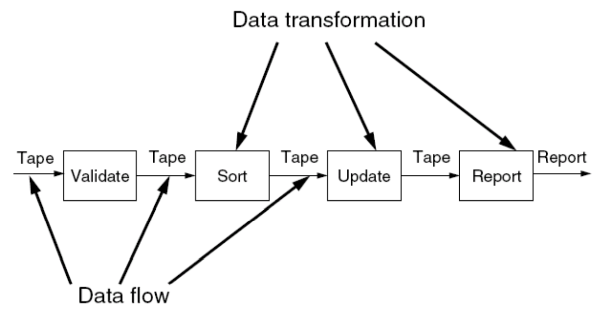

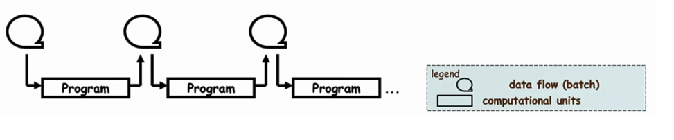

【组件】批处理风格的组件是独立计算的程序，【连接件】连接件为某种传输数据的媒介 constraint: 执行顺序确定，数据必须完整传递

【应用】

编译器，CASE 应用程序；基于 eclipse 的代码重复检测工具 函数式编程

### Pipe and filter

 管道过滤器【流式数据传输并且知道流向时适用】

**定义和特性**：把系统分解为几个序贯的处理步骤，每个过滤器都是一个独立的实体，有一组输入集和输出集。过滤器从管道中读入数据流，对输入流进行内部转换和增量计算（丰富，精炼，转换，融合，分解），然后产生输出数据流并写入管道中。数据传递不一定是个整体，数据到来时便被处理，被完全消费之前，输出便产生了。

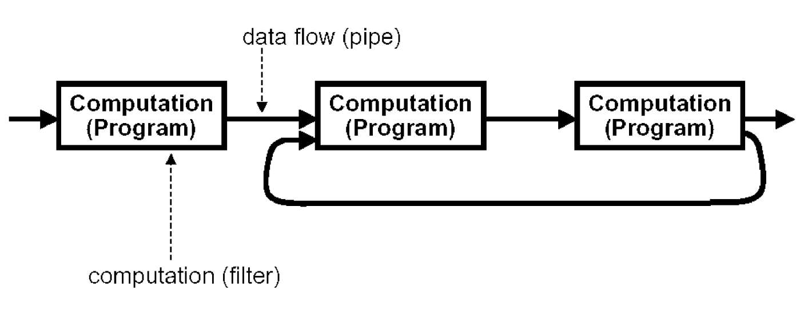

【组件】管道过滤器风格的组件是过滤器，过滤器将源数据转换为目标数据，功能包括增加，删除，转换，合并，分解。【连接件】管道过滤器风格的连接件是管道，管道的主要作用在于在过滤器之间传输数据。两个过滤器之间通过管道进行数据的传输。

constraint: 过滤器各自独立，相互无联系

【应用】编译器，图像处理程序，语音处理，数据处理，Unix管道，

| 批处理           | 管道-过滤器      |
| ---------------- | ---------------- |
| 整体传送数据     | 增量传送数据     |
| 构件颗粒度较大   | 构件颗粒度较小   |
| 延迟高，实时性差 | 延迟低，实时性好 |
| 无并发           | 可并发           |

## Call/Return

### Main Program and Subroutine

适合计算过程可被定义为结构化过程的应用；例如编程语言提供嵌套过程和结构化调用方法

**定义和特性**：调用和定义层次结构，子系统通常通过模块化来定义，系统通常会被组织成一个主程序和一系列子程序的集合。主程序担当子程序的驱动器，为子程序提供一个人控制环路，使子程序以某种次序顺序执行

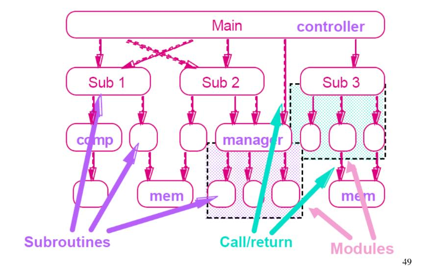

【组件】组件是主程序和子程序【连接件】连接件是主程序和子程序之间的过程调用，每个组件从其主程序获取控制和数据，并将其传
递给其子程序，数据实质是隐式共享。【约束】子程序的正确性决定了主程序的正确性。

【应用】

主程序/子程序架构风格广泛应用于各种编程语言和应用场景，包括但不限于：

- **C/C++、Java、Python等高级语言中的函数和方法**：主类或主函数调用其他函数或方法来完成特定任务。
- **操作系统中的系统调用**：用户态程序通过系统调用接口调用内核提供的子程序（系统服务）。
- **数据库查询语言（SQL）**：主查询语句中嵌套调用存储过程、函数等子程序来处理复杂数据操作。
- **图形用户界面（GUI）编程**：主事件循环调用各个事件处理器子程序来响应用户操作。

### OOP/ADT

关键词：封装、交互、继承、复用和维护、保护相关信息、限制访问

**定义和特性**：在基于面向对象的模式中，操作和数据绑定在一起，隐藏实现和其他秘密。对象通过过程调用来实现交互。有两个重要方面：对象维护自身表示的完整性；这种表示对其他对象是隐藏的

数据抽象/面向对象【组件】面向对象的风格组件是类和对象，类将属性及其相关操作进行封装，对象是类的实例，具有信息隐藏的特点【连接件】对象之间通过方法和函数调用实现交互。control structure: decentralized，usually single threaded

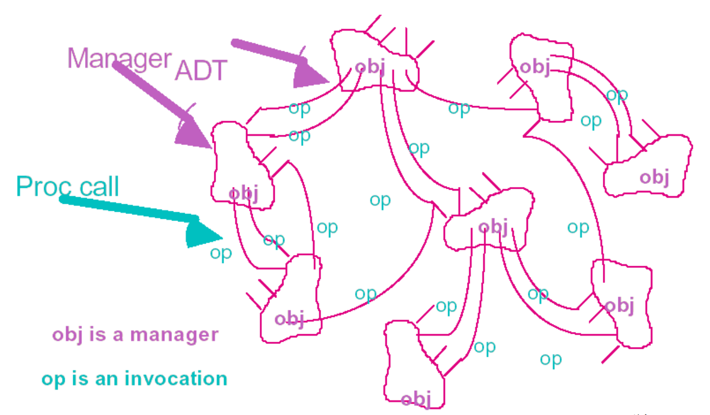

**应用实例**：游戏

### Layered System

层次架构风格 适用于不同服务类别可被分层管理的应用

**定义和特性**：每层为上一层提供服务，使用下一层的服务，只能见到与自己邻接；大的问题分解为若干个渐进的小问题，逐步解决，隐藏了很多复杂度；修改一层，最多影响两层，通常只能影响上层。若接口稳固，则谁都不影响；上层必须知道下层身份，不能调整层次之间的顺序；层层相调，影响性能

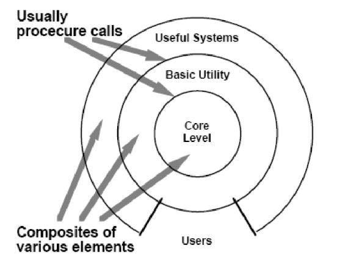

【核心原理】系统由若干层次组成，每个层次由若干组件组成，每一层为上一层提供服务，使用下一层的服务。【组件】组件是各层次内部所包含的构件【连接件】连接件是各层之间的交互协议。【拓扑结构】分层【拓扑约束】相邻层次之间的交互的约束

【应用】OSI 网络模型，操作系统的分层架构，物联网的四层体系结构

## Data centered

以数据为中心的风格架构涉及到信息传递的共享数据源方法

### Repository

适用于中心问题是为了创建、增强和维护一个复杂的中心信息体的应用

关键字：中心信息体，共享内存，多个计算进程

**定义和特性**：仓库是仓储和维护数据的中心场所

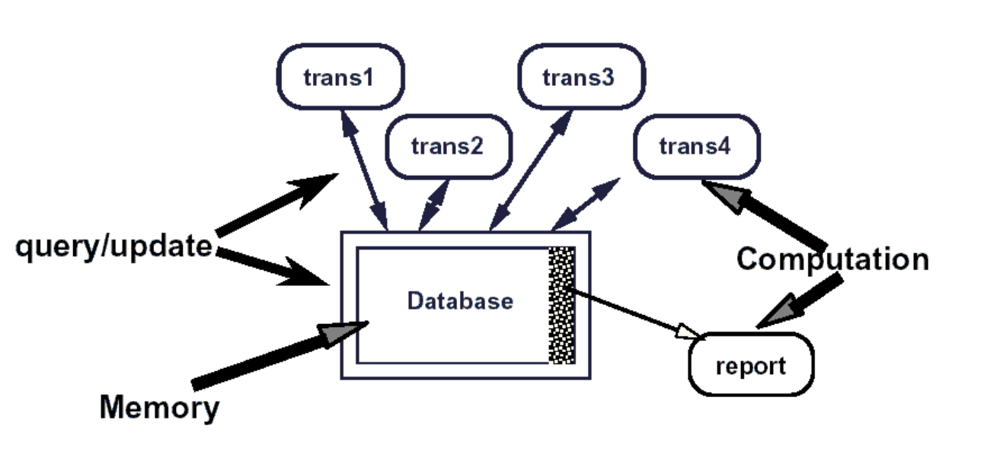、

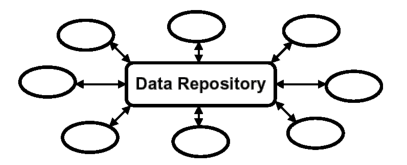

**组件**：中心数据结构——表示当前数据的状态

​        	一组对中心数据进行操作的独立构件

**连接件**：仓库与独立构件之间的交互

**应用实例**：需要操纵数据、数据需要⻓期保存，数据库，现代带符号表和语法树的编译器

### Blackboard

**知识源响应偶然事件，黑板状态驱动，状态决定知识使用，控制**
**流只修改黑板状态**

**定义和特性**：把问题分成几个部分，每个部分独立计算；全局数据库包含解域的全部状态，也是知识源互相作用的唯一媒介；完全由黑板的的状态驱动，黑板的状态的改变决定使用的特定知识，让知识源响应偶然事件；

中心数据结构的当前状态触发并选择需要执行的过程

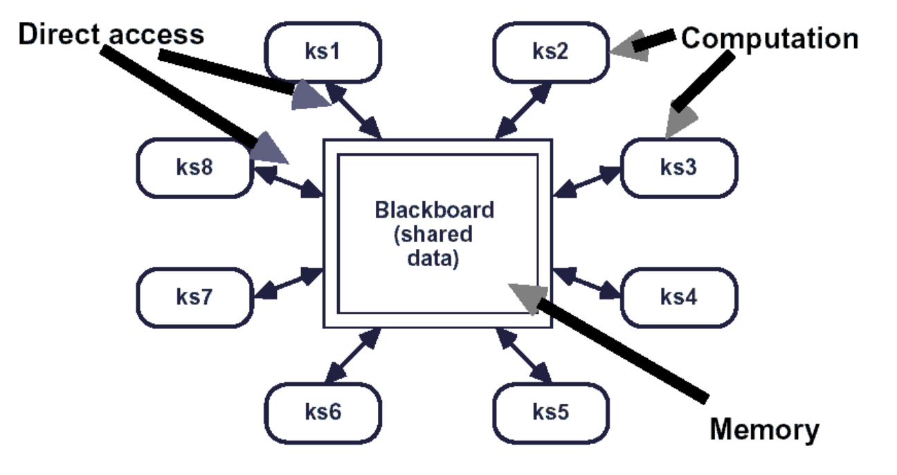

**组件**：黑板、知识源、控制器

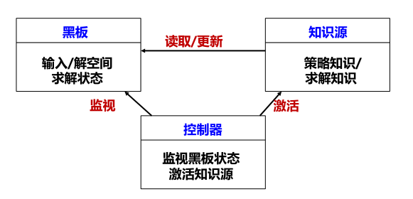

**连接件**：调用

**应用实例**：没有直接的算法可解，变化，没有唯一的解答，信号处理、专家系统、模式识别、Hearsay II Model（自然语言处理、语音处理、模式识别、图像处理等）

## Virtual machine

### Interpreter

关键字：模拟非原生功能，效率低

适合目前没有合适语言/系统来执行解决方案的应用

**定义和特性**：大多数系统不能直接支持编程语言，构建一个环境去支持

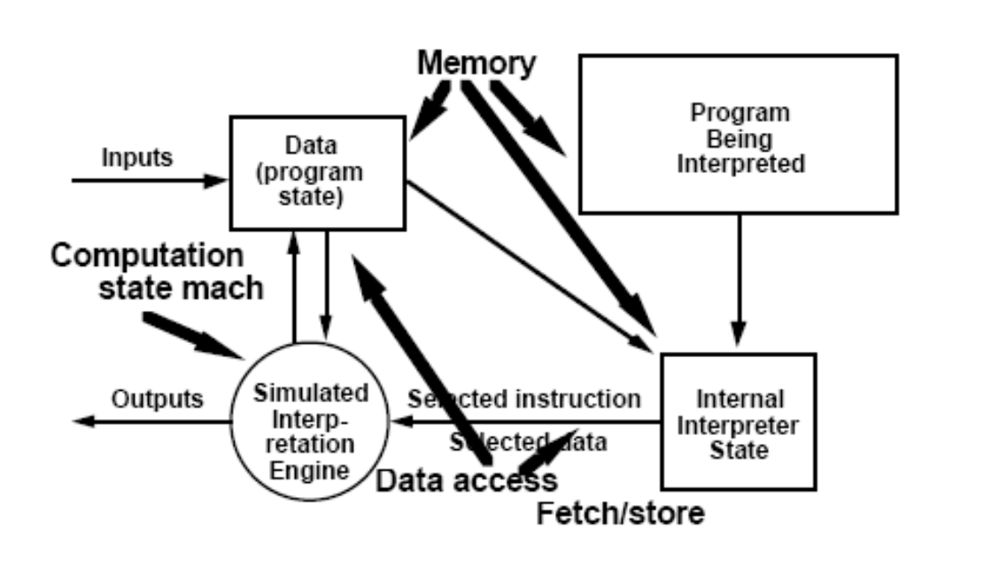

**组件**：一个状态机（解释器引擎）、三个内存（执行引擎的当前状态、正在解释的程序、正在解释的程序的状态）

**连接件**：数据访问和过程调用

**应用实例**：解释型语言、通信协议、用户输入（游戏中的组合按键）、街机模拟器、桥接，JAVA 虚拟机

### Rule-based system

关键字：知识，规则

**定义和特性**：当业务规则很复杂时，不宜用if-else结构表示；按照OCP（开放/封闭原则），应把可变部分与不变部分进行分离，在前者发生变化时就不会影响后者，核心是把频繁变化的、复杂的业务规则抽取出来，形成独立的规则库，而不是将规则写入代码。系统根据目前的状态，从规则库中选择合适的规则，对规则进行解释，根据结果控制系统的运行

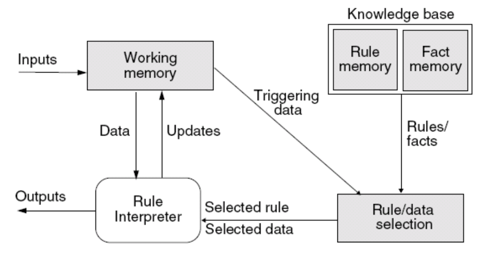

**组件**：知识库(规则库)、规则解释器、规则与数据元素选择器、工作存储区。

**连接件**：数据访问和过程调用

**应用实例**：户界面输入的合法性检查、安全规则/权限控制规则、业务策略（如VIP折扣策略等）、Drools

## Independent component

### Communicating processes

关键字：多线程

**定义和特性**：完成任务需要多个process协同，process间的协同通过message完成，message是“显性”的，即需要指明“源”和“目的地”， 组件间相对独立，依靠“发消息”通信

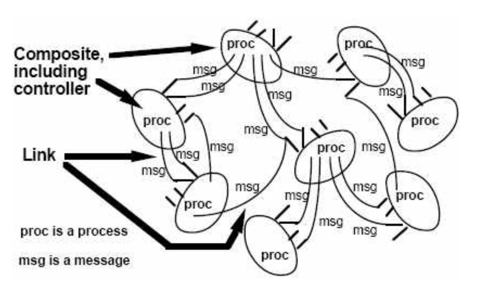

**组件**：收发消息的进程

**连接件**：消息

**应用实例**：分布式、协作式的系统

### 事件系统

Implicit invocation

关键字：事件，事件过程绑定，隐式，并行

**定义和特性**：隐式调用：通过增加一个组件将**发布者与接收者解耦合**。 事件的触发者并不知道哪些构件会被这些事件影响，相互保持独立；不能假定构件的处理顺序，甚至不知道哪些过程会被调用；各个构件之间彼此之间无连接关系，各自独立存在，**通过对事件的发布和注册实现关联**

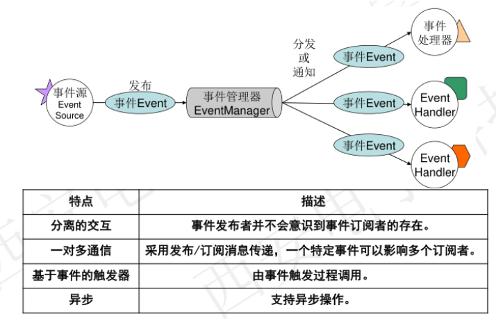

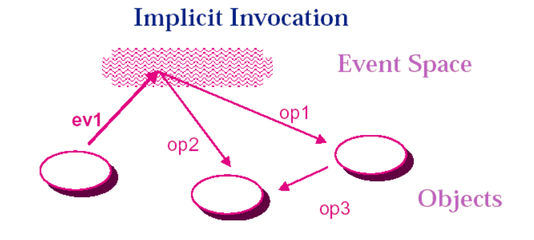

**组件**：激起事件但不知道最终接受方的进程

**连接件**：事件过程绑定、对某事件注册了的自动进程调用

**应用实例**：调试器中的断电处理、用户界面系统中管理数据、在数据库管理系统中确保数据的一致性约束

# 质量属性

## Scenario (六要素)

是一个具体的质量属性需求，场景就是风险承担者与系统的交互的简短陈述。包括六个部分:

- source: 产生刺激的实体。
- stimulus: 影响系统的条件
- artifact: 系统被刺激物刺激的部分（受影响部分）
- environment: 刺激产生的条件
- response: 系统收到刺激而产生的活动
- response measure: 系统响应如何被度量

比如：用户在系统正常运行的情况时访问网页的响应时间不超过1s，在这个质量属性描述中：

- 刺激源：用户
- 刺激物：访问网站请求
- artifact：网站服务器
- environment：正常运行
- response：正确响应，返回网页数据
- responsemeasure：响应时间不超过1s

## 可用性

 **定义：**在要求的外部资源得到保证的前提下，产品在规定条件下和规定时刻或时间区间内处于可执行规定功能状态的能力。

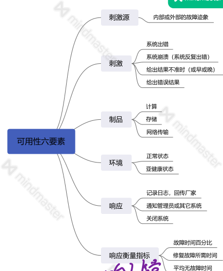

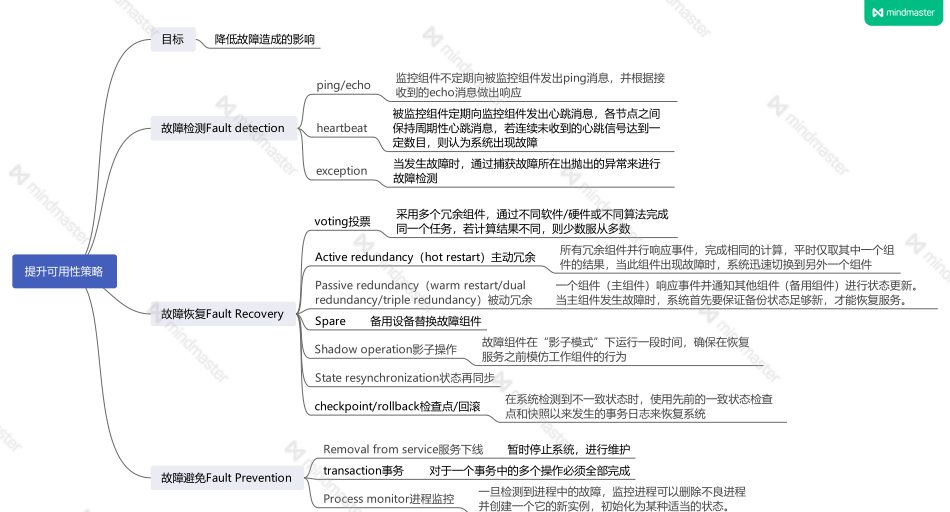

**tactics**

- Fault Detection
  - ping、Echo
  - Heartbeat
  - Exception
- Recovery-Preparation and Repair
  - Voting 
  - Active Redundancy
  - Passive Redundancy
  - Spare
- Recovery-Reintroduction
  - Shadow
  - State Resynchronization
  - Rollback
- Prevention
  - Removal from service（服务下线）
  - Transactions
  - Process Monitor(进程监控)

## 可修改性

 **定义：**可修改性关注修改的成本，系统哪些地方被修改，修改需要的时间，修改由谁进行。

 **六要素：**
（1） 刺激源：谁进行修改（开发者/管理员/用户）
（2） 刺激：要进行的具体修改
（3） 制品：修改系统的功能/UI/交互的其他地方
（4） 环境：在什么时间修改？（设计期间/开发期间/运行期间）
（5） 响应：操作人员需要理解如何修改，进行修改操作，测试，部署
（6） 响应衡量指标：时间，成本

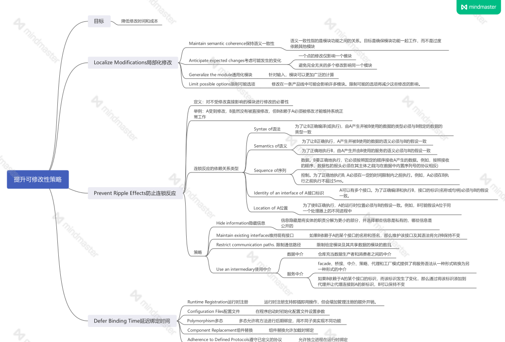

**tactics**

- Localize Changes
  - Semantic Coherence(语义一致性)
  - Anticipate Expected Changes
  - Generalize Module
  - Limit Possible Options（限制可选项）
  - Abstract Common Service
- Prevention of Ripple effect(防止连锁反应)
  - Hide Information
  - Maintain Existing Interface
  - Restrict Communication Paths
  - Use an Intermediary（使用中介）
- Defer Binding Time
  - Runtime Registration
  - Configuration Files
  - Polymorphism(多态)
  - Component Replacement
  - Adherence to Defined Protocols(遵守已定义协议) 

## 性能

**定义：**系统响应事件的速率

**六要素：**
（1） 刺激源：系统外部或内部的事件
（2） 刺激：事件的到来
（3） 制品：系统提供的服务
（4） 环境：系统可能处于不同的环境中，正常/紧急/超载
（5） 响应：系统处理到来的事件，可能导致环境变化
（6） 响应衡量指标：处理事件花费事件，单位时间内处理事件的数目，处理事件的错误率

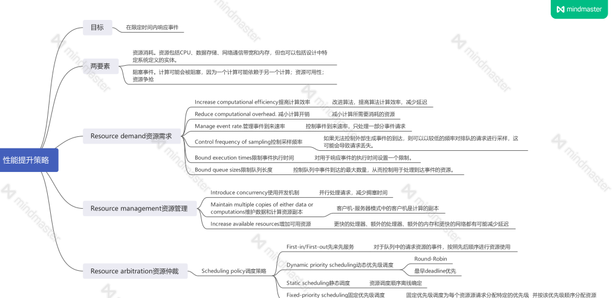

**tactics**

- Resource Demand
  - Increase Computation Efficiency
  - Reduce Computational Overhead(减少计算开销)
  - Manage Event Rate 管理事件到来速率
  - Control Frequency of Sampling
- Resource Management
  - Introduce Concurrency
  - Maintain Multiple Copies
  - Increase Available Resources
- Resource Arbitration
  - Scheduling Policy

## 安全性

**定义：**保证合法用户使用系统的前提下，抵抗对于系统的攻击/

在提供正常服务的同时对非法操作的抵御能力

**六要素：**
（1） 刺激源：攻击可能由人或其它系统发出
（2） 刺激：对系统的攻击（窃取或修改信息，获取超权限的服务）
（3） 制品：系统中提供的服务或者系统中的数据
（4） 环境：系统可能处于不同环境（联网/未联网，在线/下线，在防火墙内外）
（5） 响应：合法用户正常使用，非法用户拒绝使用
（6） 响应衡量指标：发起攻击的难度；从攻击中恢复的难度

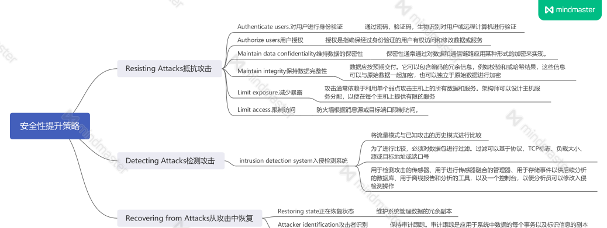

**tactics**

- Resisting Attacks
  - Auth
  - Maintain Data Confidentiality(维持数据得保密性)
  - Maintain Integrity（完整性）
  - Limit Exposure
  - Limit Access
- Dectecting attacks
  - Intrusion Dectection
- Recovering from an Attack
  - Restoration
    - See Availavility
  - Identification
    - **Audit Trail**

## 可测试性

**定义：**可以通过测试发现并证明错误的轻松程度

**六要素：**
（1）刺激源：测试可能由不同的角色发起（开发者、单元测试人员、集成测试人员、系统管理员、用户……）
（2）刺激：系统开发到达了里程碑；可能是分析/设计/编码/集成阶段的结束，或系统完成开发
（3）制品：一个设计、一段代码、整个系统……
（4）环境：系统可能处于设计阶段 / 开发阶段 / 部署阶段 / 正常运行时
（5）响应：理想的响应是可以进行测试，并且可以**观察到测试结果；**当测试结果无法被观察到时，测试难度很大
（6）响应衡量指标：

- 白盒测试中的覆盖率
  - 语句覆盖
  - 判定覆盖/分支覆盖（判定可能是多个条件组合）
  - 条件覆盖：覆盖判定中的每个条件
  - 路径覆盖、判定条件覆盖、条件组合覆盖……

- 未来继续发现 bug 的概率 

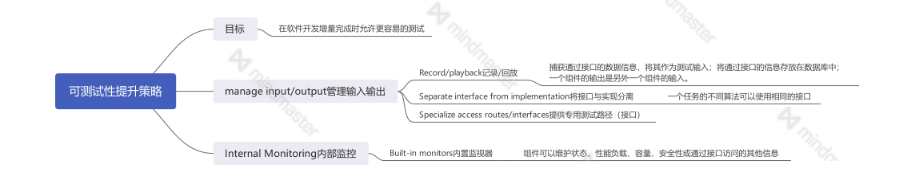

- Manage Input/Output
  - Record/ Playback(记录回放
  - Separate Interface from Implementation
  - Specialized Access Routines、Interfaces
- Internal Monitoring
  - Built-in Monitors(内置监视器)

## 易用性

**Usability**：便于用户完成期望的事情的能力

用户完成预期功能的简单程度和系统提供的用户支持种类

**六要素：**
（1）刺激源：终端用户
（2）刺激：终端用户希望学习系统的使用、提高系统使用效率、减少出错
（3）制品：整个系统
（4）环境：系统处于运行时或配置时
（5）响应：系统响应用户的要求
（6）响应衡量指标：用户完成任务的时间；用户出错的次数；用户满意度；用户操作的成功率

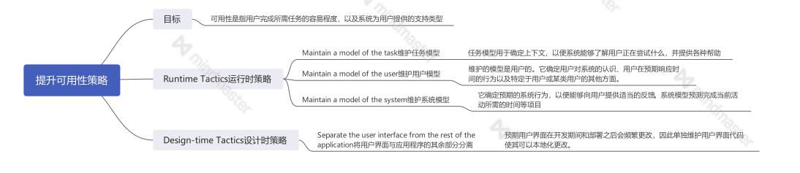

## 例题

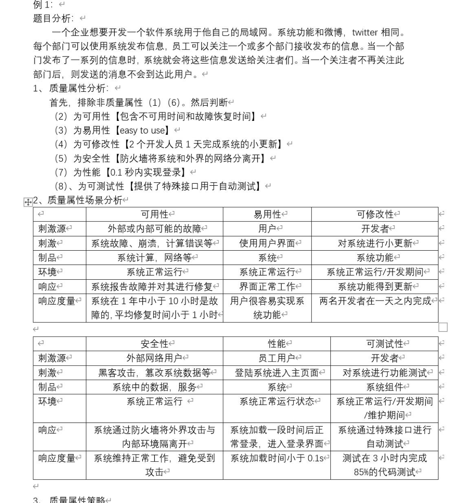

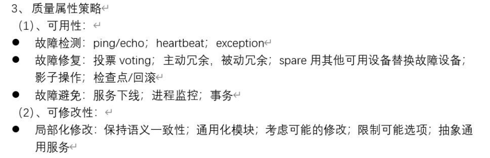

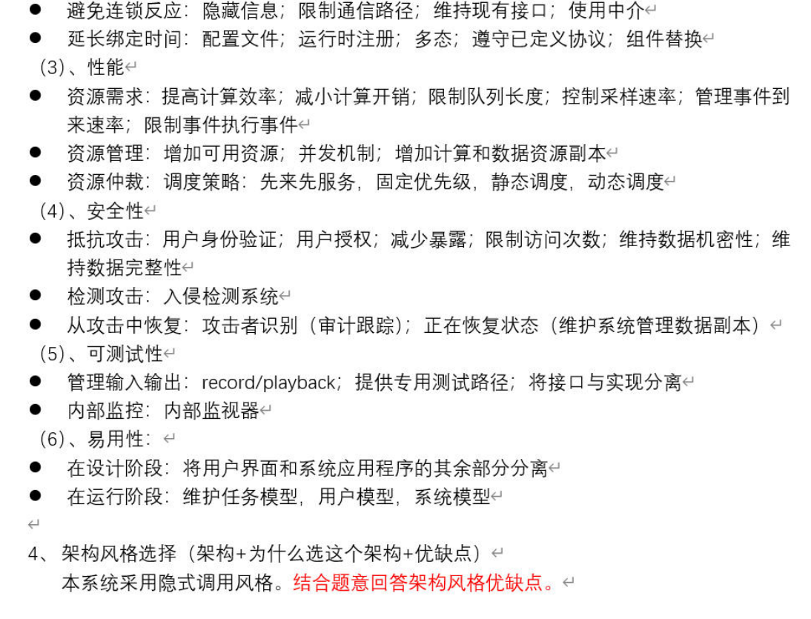

# SA评估

## 效用树 utility tree

**效用 – 质量属性 – 刺激 –（权重，风险）响应**

（1）效用树的驱动质量属性是高级节点（通常是性能、可修改性、安全性和可用性）
（2）场景是效用树的叶子节点
（3）（重要性，实现难度

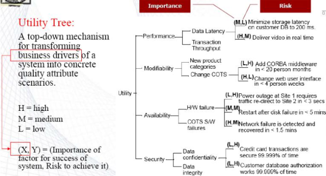

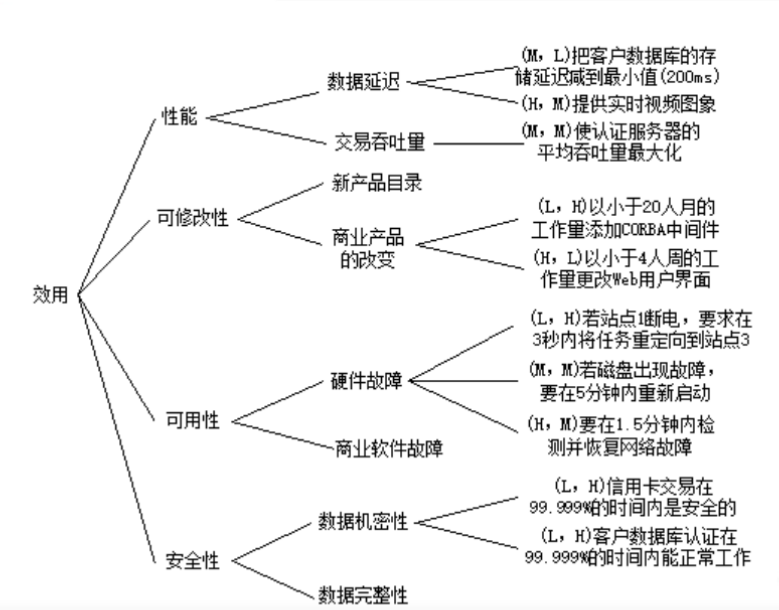

**performance:**

- latency e.g. data latency
  - 延迟 例如 数据延迟

- throughput e.g. Transaction throughput
  -  吞吐量 例如 交易吞吐量

- response time
  - 响应时间

- capacity
  - 容量

**security:**

-  confidentiality e.g. Data confidentiality
  - 保密性 例如 数据保密性

- integrity e.g. Data integrity
  - 完整性 例如 数据完整性

**modifiability:**

- modify/create/delete… e.g. Change COTS, New product
  - 修改/创建/删除... 例如 更改COTS（商用现成品），新产品

- reconfigure sth.
  - 重新配置某物

**availability:**

- failure(H/W,S/W, COTS)
  - 故障(硬件、软件、COTS)

- data loss
  - 数据丢失

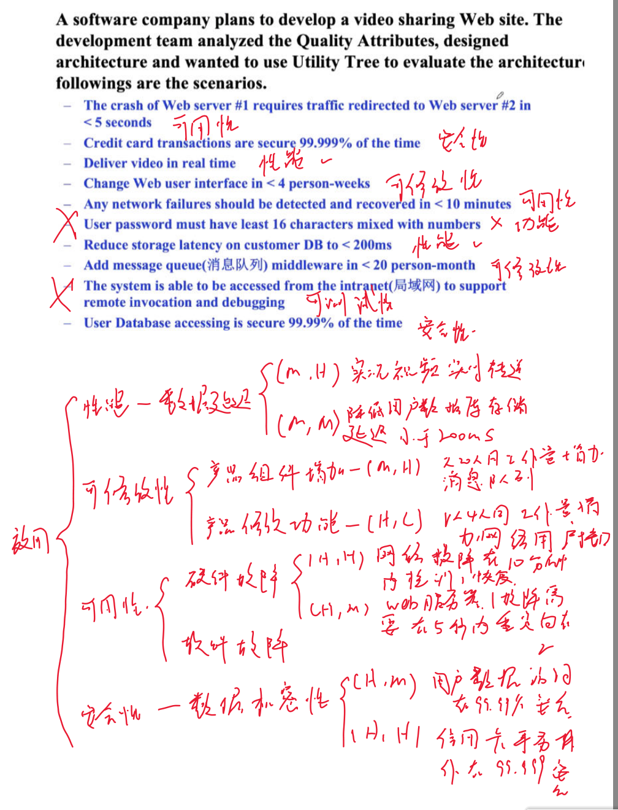

## 评估 evaluation

**risks:** 有潜在问题的设计决策
**non-risks:** 良好的、可提高架构质量，帮助实现设计目标的设计决策，通常隐式地包含在架构中
**sensitivity:** 构件或构件间关系的某一特性，这种特性会影响一个特定质量属性
**tradeoff:** 影响多个质量属性的设计决策

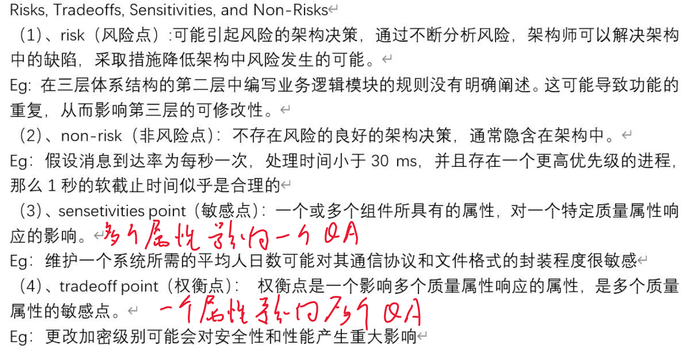

# 建模和文档化SA

## 4+1 view 

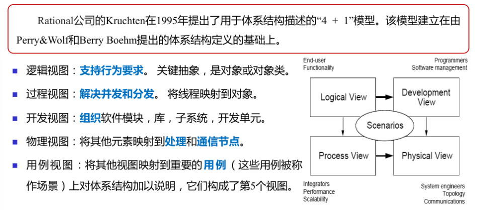

用例视图（Use case view）， 从外界来描述所建立系统的功能
逻辑视图（Logical View），系统部件的抽象描述。用来表示系统组成与部件的交互方式。
过程视图（Process View），描述系统中的过程(process)，有助于可视化系统具体功能。
物理视图（Physical View），描述了**系统设计与现实实体**对应，将抽象部件与最终系统部署相映射。
配置视图（Development View），描述了系统模块与组件如何组织。

##  UML

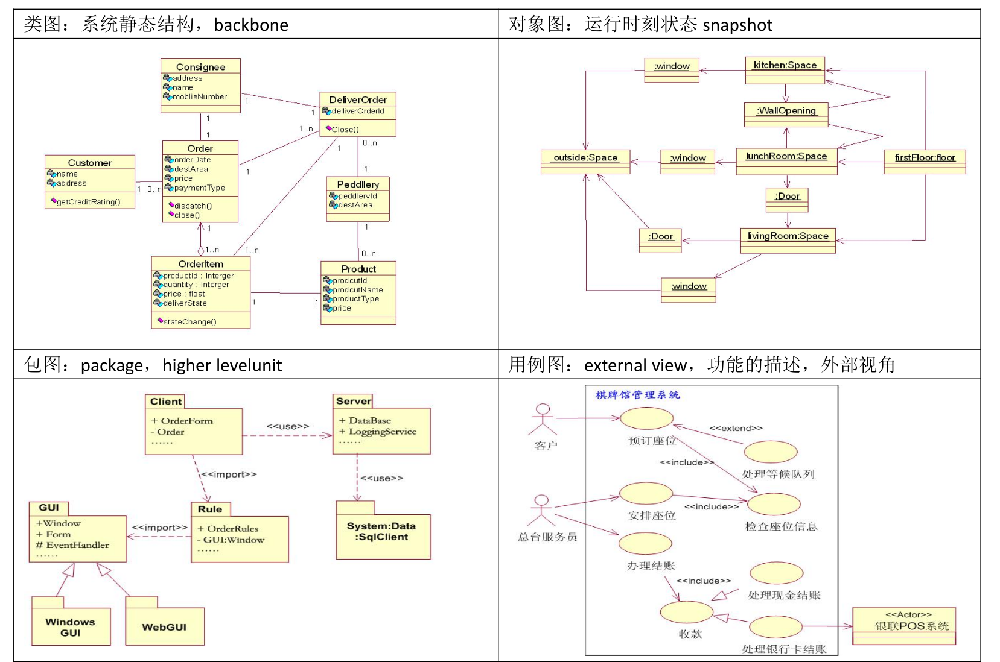

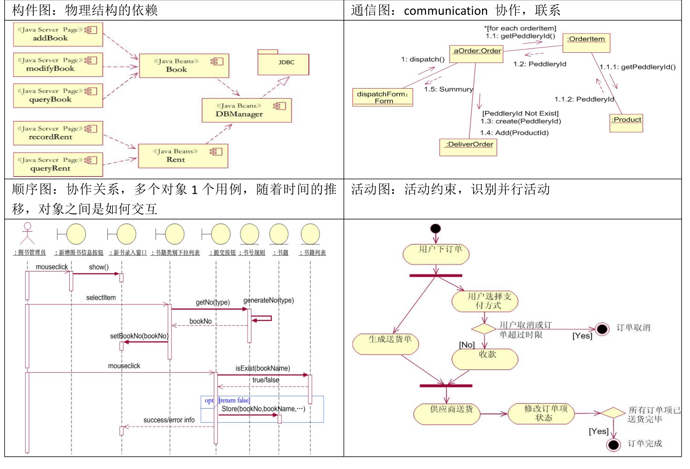

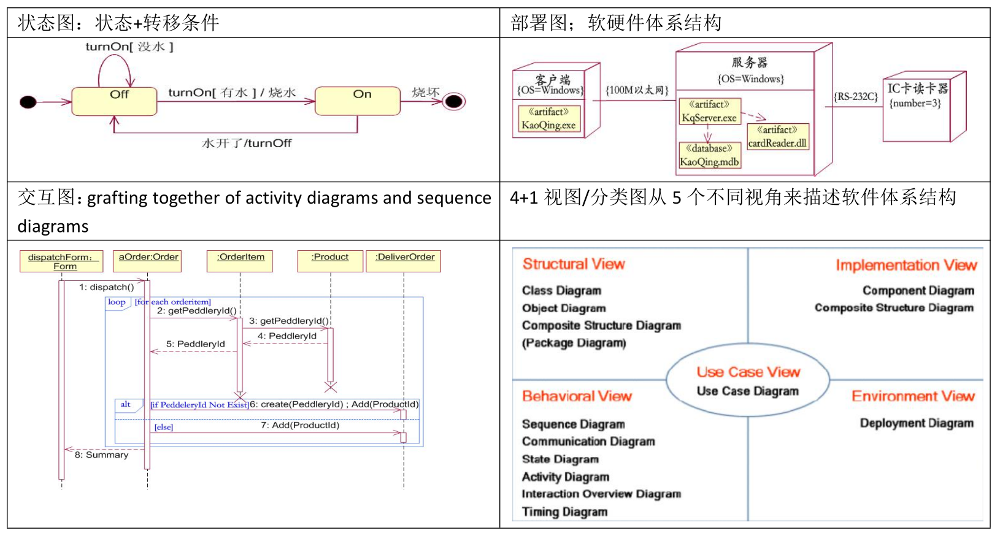

**用例图 use case**：用于显示若干角色以及这些角色与系统提供的用例之间的连接关系。用例是系统提供的功能的描述。Use cases are a valuable tool to help understand the functional requirements of a system. It is important to remember that use cases represent an external view of the system.

**类图 class diagram：**表示系统中的类和类与类之间的关系，它是对系统静态结构的描述；Class diagrams are the backbone of the UML

**对象图 Object Diagram：**object diagram is a **snapshot** of the objects in a system at a point in time. Because it shows **instances** rather than classes, an object diagram is often called an instance diagram.显示某个时间点的快照，不是类，是类的实例。Object diagrams are useful for showing examples of objects connected together 将对象连接起来

**Package Diagram 包图：**package is a grouping construct that allows you to take any construct in the UML and group its elements together into higher-level units. you can use packages for every other bit of the UML.

**Sequence Diagram 序列图：**用来反映若干个对象之间的动态协作关系，也就是随着时间的推移，对象之间是如何交互的

behavior of **several objects** within a single use case. Sequence diagrams are good at showing collaborations among the
objects; they are not so good at precise definition of the behavior.

序列图：一个用例中一系列对象的动作行为

状态图：一个对象横跨多个用例的行为

活动图：多个用例或线程之间的行为

**Communication Diagram：**描述对象间的协作关系，协作图（通信图）跟序列图相似，显示对象间的动态合作关系。如果强调时间和顺序，则使用序列图；如果**强调上下级关系，则选择协作图。**

**State Diagram 状态图：**描述类的对象所有可能的状态以及事件发生时状态的转移条件。通常，状态图是对类图的补充

**Activity Diagram 活动图：**描述满足用例要求所要进行的活动以及活动间的约束关系，有利于识别并行活动；The great strength of activity diagrams lies in the fact that they support and encourage parallel behavior

**Component Diagram 组件图：**描述代码构件的物理结构及各构件之间的依赖关系；

**Deployment Diagram 部署图：**部署图定义系统中软硬件的物理体系结构；

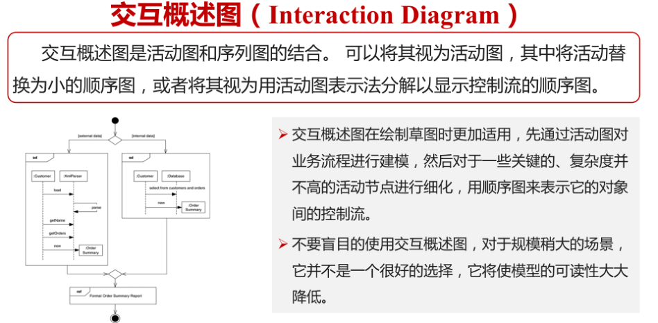
