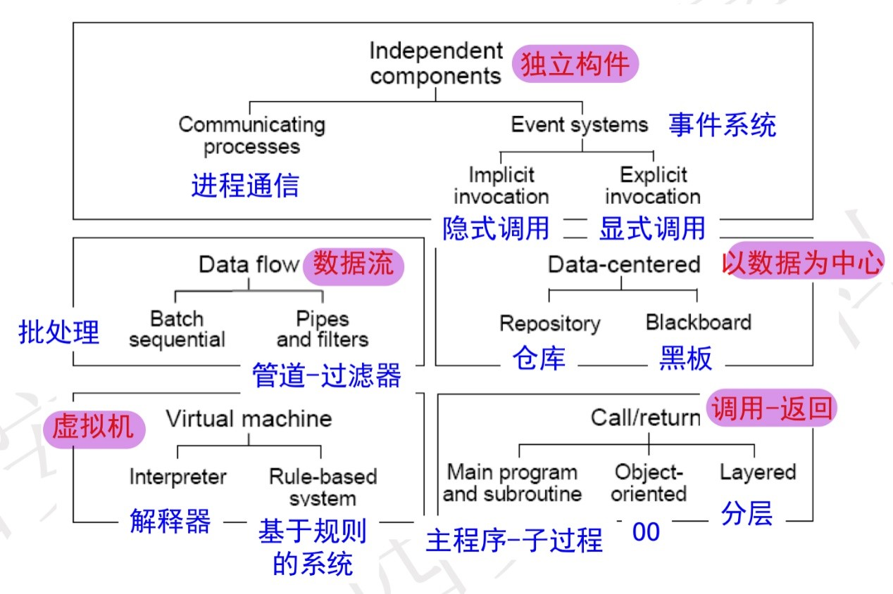

# 0、前言

​	本文档适合零基础复习。

​	软件体系结构考试题型为简答+选择+主观题，主要考察知识点为软件体系结构风格、质量属性、体系结构评估和视图。

​	需要掌握并记忆每种软件体系结构的定义、特性、优缺点、适用场景；能够判断题目所给是哪种质量属性，每种质量属性用什么方法去实现；能够区分UML中不同的图；能够判断风险/非风险、敏感点和权衡点，能够画出效用树。

# 1、软件体系结构风格

## 1.1、数据流

1. **定义和特性**：由数据控制计算；系统结构由数据在处理之间的有序移动决定；数据流系统的结构是显而易见的（强调线性/有限度的循环）

2. **组件**：数据处理

   **连接件**：数据流

3.  **应用实例**：适用于数据主导的任务，事先知道数据的确切流向

4. **优点**：模块容易替换；

   ​        	系统易于维护、理解；

   **缺点**：流程基本固定，交互性不强；

   ​			限制了系统的拓扑结构，只能是线性序列；

### 1.1.1、批处理

1. **定义和特性**：每个处理步骤是一个独立的程序；每一步必须在前一步结束后才能开始；数据必须是完整的，以完整的方式传输

2. **组件**：独立的应用程序

   **连接件**：某种类型的介质

3. **应用实例**：早期的CASE工具、代码重复检测工具

4. **优点**：

   **缺点**：

### 1.1.2、管道-过滤器

1. **定义和特性**：把系统分解为几个序贯的处理步骤，每个过滤器都是一个独立的实体，有一组输入集和输出集。过滤器从管道中读入数据流，对输入流进行内部转换和增量计算（丰富，精炼，转换，融合，分解），然后产生输出数据流并写入管道中。数据传递不一定是个整体，数据到来时便被处理，被完全消费之前，输出便产生了。

2. **组件**：过滤器——处理数据流

   **连接件**：管道——连接一个愿和一个目的过滤器

3. **应用实例**：编译器、Unix管道、信号处理

4. **优点**：

   良好的隐蔽性和高内聚低耦合的特点，可以将整个系统的输入输出行为堪称多个过滤器功能的简单合成；

   支持功能模块的重用：任意两个过滤器只要相互间所传输的数据格式上达成一致，就可以连接在一起；

   系统容易维护和拓展：新的过滤器容易加入到系统中，旧的过滤器也可被改进的过滤器替换；

   支持某些特定属性的分析，如吞吐量和死锁检测；

   支持并发执行：每一个过滤器既可以独立运行，也可与其他过滤器并发执行；

   **缺点**：

   不适合交互性很强的应用（具有随机性和不确定性）；

   系统性能不高：数据传输上没有通用的标准，每个过滤器都增加了解析和合成数据的工作，导致系统性能下降，也会增加编写过滤器的复杂性；

   | 批处理           | 管道-过滤器      |
   | ---------------- | ---------------- |
   | 整体传送数据     | 增量传送数据     |
   | 构件颗粒度较大   | 构件颗粒度较小   |
   | 延迟高，实时性差 | 延迟低，实时性好 |
   | 无并发           | 可并发           |

   

## 1.2、过程控制

1、 闭环控制器有两种通用形式：反馈控制和前馈控制。反馈控制器根据受控变量的测量值来调整过程；前馈控制通过测量其他过程变量，来预计输入变量对被控变量将产生的影响。前馈控制基于这些变量来调整过程。在实际中更有价值

反馈：开车上坡，眼睛紧盯速度表，根据车速的下降来加大油门

前馈：在看到坡以后，还未开始上坡之前，提前加速，使上坡过程顺利。

2、 系统的运行受到外部干扰，根据系统实际值和目标值而改变。一个控制持续过程的软件体系结构模式可基于过程控制模型，收集实际的和理想的过程状态信息进行比较，并能调整过程变量使得实际状态趋向于理想状态

3、 过程控制是特殊的数据流体系结构

将过程定义、过程变量以及传感器看作一个单独的子系统；将控制算法和设定点绑定在一起作为第二个子系统

有两种交互：一种是控制器从过程中获取变量的值；另一种是控制器对过程中的被操纵变量的变化提供持续性的引导

和许多线性的数据流体系结构不同，控制环路体系结构需要有循环的拓扑结构

4、 例如：空调、电脑散热、烤箱

## 1.3、调用/返回

### 1.3.1、主程序/子程序

1. **定义和特性**：调用和定义层次结构，子系统通常通过模块化来定义，系统通常会被组织成一个主程序和一系列子程序的集合。主程序担当子程序的驱动器，为子程序提供一个人控制环路，使子程序以某种次序顺序执行

2. **组件**：程序和可见的数据

   **连接件**：过程调用和显示数据共享

3. **应用实例**：强调分层的结构；程序中多次出现无规律的重复程序段；程序中重复出现有规律的复杂操作而用循环难以实现的程序段；程序比较复杂，为了使程序结构清晰，便于阅读，而把程序中具有独立功能的程序段定义成子程序

4. **优点**：逐步分解；

    	      单线程控制；

   **缺点**：只适用于可以定义为一系列步骤的问题；

   ​           子系统结构不清晰；

### 1.3.2、数据抽象/面向对象

1. **定义和特性**：在基于面向对象的模式中，操作和数据绑定在一起，隐藏实现和其他秘密。对象通过过程调用来实现交互。有两个重要方面：对象维护自身表示的完整性；这种表示对其他对象是隐藏的

2. **组件**：managers（e.g. servers、objects、abstract data types）

   **连接件**：过程调用

3. **应用实例**：游戏

4. **优点**：

   面向对象易维护，易复用；

   对象反映现实世界，容易分解一个系统；

   对象对客户实现了隐藏细节，所有可以在不影响其客户的情况下改变对象的实现 ；

   考虑操作和属性的关联性，封装完成了相关功能和属性的包装，并由对象来对它们进行管理；

   **缺点**： 

   对象的管理比较复杂，耦合度较紧。当一个对象和其他对象交互，必须知道其他对象的标识。每当一个对象的标识改变的时候，必须修改那些显示调用它的对象；

   必须修改所有显式调用它的其它对象，并消除由此带来的一些副作用。例如，如果A使用了对象B，C也使用了对象B，那么，C对B的使用所造成的对A的影响可能是料想不到的；

   

### 1.3.3、分层系统

1. **定义和特性**：每层为上一层提供服务，使用下一层的服务，只能见到与自己邻接；大的问题分解为若干个渐进的小问题，逐步解决，隐藏了很多复杂度；修改一层，最多影响两层，通常只能影响上层。若接口稳固，则谁都不影响；上层必须知道下层身份，不能调整层次之间的顺序；层层相调，影响性能

2. **组件**：通常是过程的集合

   **连接件**：取决于组件的结构，通常是严格受限的过程调用

3. **应用实例**：OSI七层模型，操作系统内核

4. **优点**：

   支持基于逐级抽象的系统设计，这允许设计者将一个复杂的问题分解成一系列递增的步骤;

   支持扩展，由于分层系统每一层最多和上下两层交互，对于任意一层功能的交互最多只影响其他两层;

   支持重用，如果能保证为相邻的层提供一致的接口，他允许系统中同一层的不同实现相互交换使用（即给同一接口建立不同实现）;

   **缺点**：

   定义一个合适的抽象层次可能会非常困难。比如，实际的通信协议体就很难映射到ISO框架中，因为其中许多协议跨多个层;

#### 1.3.3.1、客户端服务器

##### 1.3.3.1.1两层C/S架构

1.  **定义和特性**:服务器（后台）负责数据管理，客户机（前台）完成与用户的交互任务。“胖客户机，瘦服务器”

2.  **组件**：客户端、服务器

    **连接件**：网络

3.  **应用实例**：

4. **优点**：

   **缺点**：

   对客户端软硬件配置要求较高，客户端臃肿

​       客户端程序设计复杂

​       数据安全性不好。客户端程序可以直接访问数据库服务器。

​       信息内容和形式单一

​       用户界面风格不一，使用繁杂，不利用推广使用

   	软件维护与升级困难。每个客户机上的软件都需要维护

##### 1.3.3.1.2三层C/S架构

​	与二层C/S架构相比，增加了一个应用服务器 

​    应用功能分为表示层、功能层、数据层三层。表示层是应用的用户接口部分。通常使用图形用户界面；功能层是应用的主体，实现具体的业务处理逻辑；数据层是数据库管理系统。以上三层逻辑上独立。

​    整个应用逻辑驻留在应用服务器上，只有表示层存在于客户机上：“瘦客户机”

##### 1.3.3.1.3浏览器/服务器风格

​	B/S体系结构是三层C/S体系结构的特例，客户端有http浏览器即可

​    只能“拉”，不能“推”

​    客户之间的通信只能通过服务器中转

​    对客户机资源和其他网络资源的利用受限

​    B/S结构的安全性较难控制(SQL注入攻击…)

​    B/S结构的应用系统在数据查询等相应速度上，要远远低于C/S体系结构

​    服务器的负荷大，客户机的资源浪费

## 1.4、以数据为中心	

​	以数据为中心的风格架构涉及到信息传递的共享数据源方法

### 1.4.1仓库

1. **定义和特性**：仓库是仓储和维护数据的中心场所

2. **组件**：中心数据结构——表示当前数据的状态

   ​        	一组对中心数据进行操作的独立构件

   **连接件**：仓库与独立构件之间的交互

3. **应用实例**：需要操纵数据、数据需要⻓期保存，数据库，现代带符号表和语法树的编译器

4. **优点**：

   并⾏操作，更快的更新速度；

   很容易增加数据的生产者和消费者；

   **缺点**：

   更新难以保持和报告同步、ACID难以保持；

### 1.4.2黑板

1. **定义和特性**：把问题分成几个部分，每个部分独立计算；全局数据库包含解域的全部状态，也是知识源互相作用的唯一媒介；完全由黑板的的状态驱动，黑板的状态的改变决定使用的特定知识，让知识源响应偶然事件；

2. **组件**：黑板、知识源、控制器

​        **连接件**：调用

3. **应用实例**：没有直接的算法可解，变化，没有唯一的解答，信号处理、专家系统、模式识别、Hearsay II Model

4. **优点**：

   可更改性和可维护性；

​       可重⽤的知识源；

​       容错性和健壮性；

​       **缺点** ：

​	   测试困难；

​       不能保证有好的解决⽅案；

​       难以建⽴好的控制策略，问题解答的不确定性；

​       低效；

​       开发困难；

​       缺少并行机制；

## 1.5虚拟机

### 1.5.1解释器

1. **定义和特性**：大多数系统不能直接支持编程语言，构建一个环境去支持

2. **组件**：一个状态机（解释器引擎）、三个内存（执行引擎的当前状态、正在解释的程序、正在解释的程序的状态）

​       **连接件**：数据访问和过程调用

3. **应用实例**：解释型语言、通信协议、用户输入（游戏中的组合按键）、街机模拟器、桥接

4. **优点**：

   仿真不具备的功能；

​       测试（模拟病毒）；

​       灵活（Java在各个地方都能运行）；

   	**缺点**：

​	   性能差；

​       引入额外需要测试的地方；

### 1.5.2规则系统

1. **定义和特性**：当业务规则很复杂时，不宜用if-else结构表示；按照OCP（开放/封闭原则），应把可变部分与不变部分进行分离，在前者发生变化时就不会影响后者，核心是把频繁变化的、复杂的业务规则抽取出来，形成独立的规则库，而不是将规则写入代码。系统根据目前的状态，从规则库中选择合适的规则，对规则进行解释，根据结果控制系统的运行

2. **组件**：一个解释引擎（rule interpreter（Interpretation engine））、三个存储区（knowledge base（Code to be executed）, rule/data selection（control state of interpreter）, working memory（current state of the code））

   **连接件**：数据访问和过程调用

3. **应用实例**：户界面输入的合法性检查、安全规则/权限控制规则、业务策略（如VIP折扣策略等）、Drools

4. **优点**：

   降低修改业务逻辑的成本与风险；

​       缩短开发时间；

​       规则可以在多个应用中共享；

​       可以解决非常困难的难题；

​       逻辑和数据分离；

​       **缺点**：

​	   难以观察单条规则对整个决策的作用；

​       低效的搜索策略；基于规则的⼤型系统不适用于实时应用；

​       没有学习能力，无法打破规则；

## 1.6、独立组件

### 1.6.1、进程间通信

1. **定义和特性**：完成任务需要多个process协同，process间的协同通过message完成，message是“显性”的，即需要指明“源”和“目的地”， 组件间相对独立，依靠“发消息”通信

2. **组件**：收发消息的进程

   **连接件**：消息

3. **应用实例**：分布式、协作式的系统

4. **优点**：

​       **缺点**：

### 1.6.2、事件系统

1. **定义和特性**：隐式调用：通过增加一个组件将发布者与接收者解耦合。 事件的触发者并不知道哪些构件会被这些事件影响，相互保持独立；不能假定构件的处理顺序，甚至不知道哪些过程会被调用；各个构件之间彼此之间无连接关系，各自独立存在，通过对事件的发布和注册实现关联

2. **组件**：激起事件但不知道最终接受方的进程

   **连接件**：事件过程绑定、对某事件注册了的自动进程调用

3. **应用实例**：调试器中的断电处理、用户界面系统中管理数据、在数据库管理系统中确保数据的一致性约束

4. **优点**：

   为软件的宠用提供了强大的支持。当需要将一个构建加入现存系统中时，只需要将它注册到系统的事件中；

​       为改进系统带来了方便。当用一个构件代替另一个构件时，不会影响到其他构件的接口；

​       性能好，调用支持并行化；

​       鲁棒性好，一个组件出问题不影响其他；

​	   **缺点**：

​	   对于问题分解，无法控制调用顺序、函数调用存在语义问题、难以确保正确性；

​       对于系统维护和重用，需要一个记录信息关于事件、注册、调度策略的中央“黄页”；事件处理可能与其他事件冲突，例如rpc；

​       对于性能，间接和通信意味着性能损失；

# 2、质量属性及对应方法

## 2.1、易用性

- **运行时策略**

  系统猜测用户要完成的任务

​       系统给用户适当的反馈

​       系统给用户提供一致的体验

​       支持撤销操作

- **设计时策略**

​       把用户界面和系统其他部分隔离开

## 2.2、安全性

- **抵抗攻击**

  用户的证实：密码、验证码

  用户的授权：确认用户的操作在权限范围内

  维持数据的保密性：数据和传输过程加密

  维持数据的完整性：MD5码校验

  减少暴露：关闭无用端口、自启动的服务、无线路由SSID

  限制访问：白名单、黑名单

- **检测攻击**

  入侵检测系统

​       安全专家

- **从攻击中恢复**

​       恢复状态（可用性）

​       攻击者识别

## 2.3、可测试性

- **白盒测试**

  内部监控（IDE提供的断点调试，WinDbg）

- **黑盒测试**

  记录/回放

​       接口和实现分离开

​       提供专用的测试路径

## 2.4、可用性

- **故障检测**

​       Ping/echo

​       心跳

​       Exceptions（抛出+捕获+处理）

- **故障恢复**

​       投票

​       主动冗余

​       被动冗余

​       检查点/回滚

- **故障避免**

  服务下线

​       事务

​       进程监控

## 2.5、可修改性

- **限制修改范围**

​       模块高内聚、低耦合

​       考虑到可能发生的修改

​       让模块通用

​       隐藏信息

​       维持接口不变

​       限制通信路径

​       使用中介

​       命名服务器

​       按需创建实例

- **延迟绑定时间**

  配置文件

​       发布订阅模式

​       多态

## 2.6、性能

- **资源的需求**

​       提高计算效率

​       减少要处理的数据总量

​       限制执行时间

​       限制待处理事件队列长度

- **资源的管理**

​       利用并发机制

​       增加可用资源

- **资源的仲裁**

​       先来先服务

​       固定优先级调度

​       动态优先级

# 3、软件体系结构建模

本章参照老师课件即可

SA03

## 3.1、”4+1“视图

## 3.2、UML

# 4、体系结构评估

本章参照老师课件即可

## 4.1、质量属性评估效用树

## 4.2、风险/非风险、敏感点和权衡点

