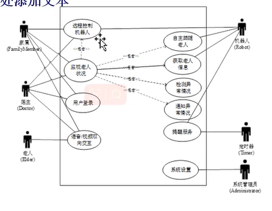

# 第一章 概述

## 定义: 软件

**必考**
软件是**文档、指令、数据结构**的集合

> 软件 = 文档+指令+数据结构

- Documents that describe the operation and use of the programs.
  文档描述了程序的操作(operation)和使用(use)。
- Instructions (computer programs) that when executed provide desired function andperformance;
  指令在执行时提供了所需的功能(function)和性能(performance)。
- Data structures that enable the programs to adequately manipulate information;
  数据结构使程序能够充分地操作信息(information)。

**软件的3个特性**

1. 软件是开发或工程的，而不是传统意义上的制造.
2. 软件不会“磨损”，但会恶化。
3. 大多数软件都是定制的，而不是由现有组件组装而成.

## 定义: 软件工程

**必考**
The application of a systematic , disciplined, measure-able approach to the development,operation, and maintenance of software. That is, the application of engineering to software.
软件工程是将**系统的(systematic)、规范的(disciplined)、可度量的(measurable)**方法应用于软件的**开发(development)、运行(operation)和维护(maintenance)**的过程，即将工程化应用于软件中。

> 系统+规范+可度量、开发+运行+维护

Any Problem-solving technique must have two parts, **analyzing** to problem to determine its nature, and then **synthesizing** a solution

## 软件涉及到的人员

- consumer 需求提出者(pay)
- developer 开发人员
- user 软件的实际使用者

## 质量指标

1. The Quality of the Product, **McCall**
     度量软件质量的指标模型
2. The Quality of the Process, **CMM** (Capability Maturity Mode)
     度量过程质量的指标模型
     iso 9000 spcie
3. The Quality in the Context of the Business Environment, **ROI**
     度量商业价值的指标模型

## 系统

**What is a system？**

- system is a **collection** of **objects and activities,** plus a description of the **relationships** that tie the objects and activities together.

系统是对象和活动的集合，加上对象和活动之间关系的描述。

> 系统 = 对象+活动集合+两者的关系描述

**The Elements of a System**

- objects and activities 对象和活动
- relationship and the system boundary 关系和系统边界
- **examples** of system 系统实例

The software development usually involves **requirement analysing and defination, system design, program design, program implementation, unit testing, integration tesing, system delivery and maintenance stages**

软件开发步骤：**需求分析和定义、系统设计、程序设计、程序实现（编程）、单元测试、系统(集成)测试、交付系统、系统维护(类似瀑布)**

Any entity to be engineered ,we must do **analysis** , **design**, **construction**, **verification** and **managment**

任何要设计的实体，我们都必须做**分析，设计，施工，验证和管理**

> engineered = 分析+设计+施工+验证+管理

> 简答：Briefly describe the roles of analyst, designer, programmer, tester, and trainer.
>
> the requirement analyst work with customer, break down what the customer wants into discrete requirement.
>
> analyst与客户一起工作，将客户的需求分解成离散的需求。
>
> the designer generate the system-level description of what the system is to do
>
> **designer生成关于系统要做什么的系统级描述**
>
> the programmer write line of code that implement what requirement specify.
>
> coder编写一行行代码，实现需求指定。
>
> the tester catches faults that programmer overlook
>
> tester发现程序员忽略的错误
>
> the trainer shows users how to use the system
>
> trainer培训师向用户展示如何使用该系统

# 第二章 过程

## 定义: 过程 process

**必考**
process：A series of ordered steps involving activities, constraints, and resources that produce an intended output of some kind.
一系列涉及**活动、约束和资源**的步骤，这些步骤会产生某种预期的输出。

**过程 = 步骤** —— 包含：**活动 + 约束 + 资源**

> 系统=对象+活动+关系

> 过程= 活动+约束+资源）步骤

## 定义: 生命周期 Life cycle

**必考**
当过程涉及到建设某些产品，我们有时把过程称为生命周期。
when the process involves the building of some **product**, we sometimes refer to the process as a life cycle.
The life cycle of a software product include **conception(概念化),implementation(实现)，delivery(交付)，use,(使用) maintenance.(维护)**

软件的生命周期：**概念、实现、交付、使用、维护**

> 软件生命周期=概念化+实现+交付+使用+维护

> 分辨:工程我们都必须做**分析，设计，施工，验证和管理**

prescription and description

## 定义: 模型

一个过程可以用多种方法来描述，使用文字、图片或组合
A process can be described in a variety of ways, using text, pictures or a combination.

**必考**(步骤与优缺点)

### 瀑布模型

1. Requirements Analysis 需求分析
2. System Design 系统设计
3. Program Design 程序设计
4. Coding 编程
5. Unit & Integration Test 单元&集成测试
6. System Test 系统测试
7. Acceptance Test 验收测试
8. Operation & Maintenance 使用与维护

特点:

1. One of the first process development models
    是第一个被提出的开发模型之一
2. Works for well understood problems with minimal or no changes in the requirements
    适用于非常容易理解的问题，需求很少或没有变化
3. It presents a very high-level view of the development process开发过程的顶层理解
4. and sequence of process activities 顺序过程
5. Each major phase is marked by milestones and deliverables 每个主要阶段都具有里程碑和可交付成果
6. Many other,more complex models are really just embellishments of waterfall,incorporating
    feedback loops and extra activities.
    许多其他更复杂的模型实际上只是瀑布的升级

优点:

- The waterfall model can be very useful in helping developers lay out what they need to do.
  在帮助开发人员**规划**他们需要做的事情时非常有用
  
- Its simplicity makes it easy to explain to customers who are not familiar with software
  development.
  它的**简单**性使得**向不熟悉软件开发的客户解释它很容易**
  
- It makes explicit which intermediate products are necessary in order to begin the next stage
  of development.
  它明确了哪些中间产品是必要的，**以便开始下一阶段的开发**。
  
- （规范化方法）强迫开发人员采用规范化方法

- （文档）严格规定每个阶段必须提交的文档

- （验证）要求每个阶段交出的所有产品必须是经过验证的

  

缺点：

- Provides no guidance how to handle changes to products and activities during development（需求确定）
  (assumes requirements can be frozen)
  没有提供有关如何在开发过程中**处理产品和活动更改**的指导（假设要求可以冻结）
- Views software development as manufacturing process rather than as creative process
  将软件开发视为**制造过程而非创意**过程
- There is no iterative activities that lead to creating a final Product
  **没有迭代**活动可以创建最终产品
- Long wait before a final product
  **长时间**等待最终产品
- **由于瀑布模型几乎完全依赖于书面的规格说明，很可能导致最终开发出的软件产品不能真正满足用户的需要**（依赖书面）

### V模型 

概念：V模型更明确地说明了瀑布模型中隐藏的一些**迭代和返工**，是瀑布模型的变种

The V model makes more explicit some of the iteration and rework that are hidden In the waterfall

 特点：

（1）采用**测试**来验证程序设计

（2）采用**集成测试**来验证体系结构设计

（3）采用**验收测试**来确认需求

（4）验证过程中发现问题即可在执行后续测试步骤前重新执行左边步骤对软件修正

### 原型化模型 prototyping model

概念：在需求分析阶段对软件进行初步的分析和定义，快速开发出简单的软件原型并向用户展示，用户对软件原型进行测评后进一步提出进要求，开发人员的原型修改到用户满意为止。**因此原型模型的开发更能符合需求，适合市场导向（market-driven）的产品。**

A prototyping model is a partially developed product that enable customers and developers。 To examine some aspect of the proposed system and decide if it is suitable or appropriate for the final product.

> 原型模型是部分开发的产品，支持客户和开发人员。检查建议系统的某些方面，并决定它是否适合最终产品。

优点：

（1）（**需求）有助于满足用户的真实需求**

（2）（规格说明）原型系统已经通过与用户进行交互而得到验证，据此产生的规格文档能正确描述用户的需求

（3）（开发顺序）软件产品的开发基本上是按线性顺序进行

（4）（加速开发，节约成本）建造出原型系统后，开发人员可以加速软件开发的过程，节约软件开发成本

> To elicit the requirements effectively（提取需求）, it is most suitable.
> If a system is being developed where the customers are not sure of what they want，the requirements are often poorly defined.（需要提取需求）（ Prototyping model ） would be an appropriate process model for this type of development.
> It is most suitable for market-driven（市场驱动） software.
> ————————————————
> 版权声明：本文为CSDN博主「sandalphon4869」的原创文章，遵循CC 4.0 BY-SA版权协议，转载请附上原文出处链接及本声明。
> 原文链接：https://blog.csdn.net/sandalphon4869/article/details/92843264

### 增量模型 incremental model 

> ## Phased development: increments and iterations

增量：将系统功能划分为诸多子系统，先开发具有一个小功能的子系统，之后不断在子系统上增加新的功能来逐渐满足所有需求

迭代：第一次提交的产品就是一个完整的系统，之后在该系统的基础上不断修改，不断开发出新的版本，但是每个版本都是完整可运行的版本

优点：

（1）(短时间)能在较短时间内向用户提交完成一些有用功能的工作产品 

（2）（用户学习适应）逐步增加产品的功能可以使用户有较充裕的学习时间和适应新产品

 （3）项目失败的风险较低

 （4）优先级最高的服务首先交付，然后再将其他增量构件逐次集成进来，这意味着最重要的部分将接受最多的测试

缺点：（1）与其他模型相比需要更精心的设计

### 螺旋式模型 spiral model

概念：**瀑布模型与原型模型的组合**，既可以周期性地验证客户的需求，又可以分阶段进行开发工作，能保证软件在遇到较大风险时停止，大大增强了**软件的风险防控能力**。**但是过程很复杂，需要开发人员有丰富的风险评估能力和专业知识**，适合大型项目的开发。

The spiral model combine the development activities with risk management to minimize and control the risk control。

优点：

（1）对可选方案和约束条件的强调有利于已有软件的重用，也有助于把软件质量作为软件开发的一个重要目标

（2）减少了过多测试或者测试不足带来的风险

（3）维护只是模型的另一个周期，因此在维护和开发之间并没有本质区别

 缺点：（1）要求开发人员必须具有丰富的风险评估经验和专门知识

### Agile method敏捷开发

# 第三章 项目管理

## 一、项目追踪

## 定义: 进度 Schedule

- A project schedule describes the software development cycle for a particular project by enumerating the phases or stages of the project and breaking each into discrete tasks or activities to be done.
  项目进度通过**列举项目的时期或阶段**，并将每个阶段**分解**为待完成的离散任务或活动来**描述**特定项目的软件开发周期。
- The schedule is a **timeline** that shows when activities will begin and end,and when the
  related development products while be ready.
  进度表是一条时间线，它显示了**活动开始和结束**的时间，以及**相关开发产品准备就绪**的时间。

> 项目进度：描述项目的软件开发周期

## 定义: 活动

An activity is a part of the project that takes place over a period of time.
活动是在一段时间内发生的项目的**一部分**

## 定义: 里程碑 Milestone

A milestone is the completion of an activity，a particular point in time.
里程碑是**一个活动的完成**，一个特定的时间点。

> 活动=一段时间内发生的项目的一部分
>
> 里程碑=一个特定的时间，一个活动的完成

## WBS

- 工作分解结构(WBS)将项目描述为一组离散的工作片段。
  work breakdown structure depicts the project as a set of discrete pieces of work.

  - Precursor is an event or set of events that must occur before the activity can begin.
    前驱是在活动开始之前必须发生的一个或一组事件。
  - Due date is the date by which the activity must be completed,frequently determined by
    contractual deadlines.
    截止时间是活动必须完成的日期，通常由合同期限决定。
  - Duration is length of time needed to complete an activity。
    工期是完成一项活动所需的时间长度。
  - Endpoint is usually a milestone or deliverable
    终点是里程碑或可交付件。

  

## 关键路径

The critical path is the one for which the slack at every node is zero.
  关键路径是每个节点的松弛度为零的路径。

 **必考大题**

## 二、项目人员

### /交流组织

**交流线 lines of communication** ：如果一个工作中有n个人，那么一共有n（n-1）/ 2条交流线

### work style

characteristics ：Extrovert（外向）Introvert（内向）Intuitive（直觉 Rational（理智）

Extroverts（外向）: tell their thoughts
Introverts（内向）: ask for suggestions
Intuitives（直觉）: base decisions on feelings
Rationals（理智）: base decisions on facts, options

> Shane is an efficient leader（外向的）.He knows what he wants and relies on his own experiences and logic to make **decisions.(依据逻辑**)He does not feel the need for extensive information before making a decision.He is capable of making fast decisions.Shane’s work style would be described best as （ Rational extrover ）

### 组织形式：

（选择题）

 首席程序员团队 **chief programmer team**：高效的组织方式

 适用于：大项目 large scale，高确定性 high certainty，重复性 repetition

 **egoless approach**

 适用于：小项目 small scale，新技术 new technology，不确定性 uncertain

### 三、Effort estimation

Can not produce accurate estimates
Effort estimation techniques – expert judgment, algorithmic methods, machine-learning ethods

## /风险

风险评估 risk assessment：

- 风险识别 risk identification
- 风险分析 risk analysis
- 风险分级 risk prioritization

风险控制 risk control：

- 减少风险 reduce risk
- 风险管理计划 risk management planning
- 风险解决 Risk resolution

# Risk exposure calculation

Risk exposure(成本) = (risk probability) x (risk impact)

## add

**Give some diliverables：列出一些可交付物**

 **文件**
 **功能演示**
 **准确性演示**
 **子系统演示**
 **可靠性、性能或安全性演示**

Briefly describe the characteristic of software development team’s individual：描述软件开发团队个体的特征

 执行工作的能力
 对工作的兴趣
 使用类似工具或语言的经验
 类似技术的经验
 具有类似开发环境的经验
 训练
 与他人沟通的能力

#   第四章 需求分析

##   定义: 需求

  期望行为的一种表达。

  四种需求:

- **functional requirement : 功能性需求**
    describes required behavior in terms of required activities根据所需的活动描述所需的行为。eg：系统应与外部系统 X 通信，必须满足哪些条件才能发送消息
-   **nonfunctional requirement (quality function) 非功能性需求(质量需求)**
    describes some quality characteristic that the software must possess.描述软件必须具备的一些质量特征。eg：系统限制高级管理人员的访问权限。安全可靠
-   **design constraint 设计约束**
    a design decision,such as choice of platform.设计决策，如平台的选择。接口与组件限制设计
-   **process constraint 过程约束**
    a restriction on the techniques or resources that can be used to build the system.对可用于构建系统的技术或资源的限制。

需求捕获：

The process for capturing the requirement has four steps, there are **elicitation，analysis , specification,and validation。**

> 启发、分析、规范和验证。

## resolving conflicts——priority

correct ：we and customer read it , and they comfirm our understanding
consistant：no conflicting requirement
unambigious：muliple readers of the requirements can walk away with different but valid interuptions
complete：specifies required behavior and output for all possible inputs in all possible states under all possible constraints.
feasible： there is a solution
relevent：restricts the developers unnecessarily, or includes functions that are not directly related to the customer’s needs.
testable：acceptance tests that would clearly demonstrate whether the eventual product meets the requirements.
traceable：the requirements organized and uniquely labeled for easy reference.

> 正确:我们和客户都看过了，他们确认我们的理解
> consistent:没有冲突的要求
> 明确的:需求的多个读者可以带着不同但有效的中断离开
> 完整:在所有可能的约束下，为所有可能的状态下的所有可能的输入指定所需的行为和输出。
> 可行的:有一个解决方案
> 相关的:不必要地限制开发人员，或者包含与客户需求不直接相关的功能。
> 可测试的**:能够清楚地证明最终产品是否满足需求**的验收测试。
> 可追溯性**:需求的组织和唯一标记便于参考**。

## 需求特性

correct、consistent 一致性 、ambigious 模棱两可的、complete、feasible 可行的、relevent 相关的、testable 可测试的、traceable 可追踪的 、unverifiable 无法验证的

> 是的，括号里的内容是正确的。
>
> 1. "The requirements are testable": 一个好的需求应该是可以测试的。这意味着，你应该能明确地证明一个特定的功能是否满足了需求。一个可以测试的需求有明确的接收标准，可以用来判断系统是否正确地实现了需求。测试性（Testability）是一个非常重要的需求属性，它能帮助开发者理解需求是否已经被满足。
>
> 2. "The system should be constructed so that it will be easy to add new functionality in the future." This requirement is unverifiable: 这个需求是无法验证的。"易于增加新功能"是一个主观的、模糊的描述，它没有明确的测试标准。不同的人可能对"易于增加"有不同的理解和期望。对于一个人来说，可能需要花费一小时才能添加一个新的功能，而对另一个人来说，可能只需要十分钟。因此，这个需求是无法验证的。一个好的需求应该是可衡量的，有明确的接受标准。
>
> 所以，需求应该尽量明确、可衡量、一致且可测试。这样才能减少因理解不同而产生的问题，提高软件开发的效率。

"系统应该易于使用"并不是一个好的需求（good requirement），原因在于这个需求太模糊和主观了。

好的需求应该是明确的（clear）、可衡量的（measurable）、可测试的（testable）、相关的（relevant）以及详细的（detailed）。换句话说，一个好的需求应该具备SMART属性：具体（Specific）、可衡量（Measurable）、可达成（Attainable）、相关的（Relevant）和有时限的（Time-bound）。

"系统应该易于使用"这个需求没有明确定义什么是"易于使用"。对于不同的人来说，"易于使用"可能有不同的含义。因此，这个需求应该被进一步细化和量化，例如，指定某些特定任务的完成应该在一定的时间内，或者用户在使用过程中遇到错误的频率应该在某个特定的阈值以下。只有当需求明确且可衡量时，才能有效地设计和测试系统以满足这些需求。

## Requirement Modeling notations

### Entity-relationship diagrams（ERD/E-R）

**表示概念模型**的一种方法，包含实体，关系，属性三个要素。对应UML中的类图。

A way to represent a conceptual model that contains three elements: **entity, relationship, and attribute.** Corresponds to a class diagram in UML.

> Briefly describe the functions of three core construct of ERD.
>
> entity：represents a collection (sometimes called a class) of real-world objects that have common properties and behaviors.
>
> 表示**具有公共属性和行为**的现实世界对象的集合(有时称为类)。
>
> relationship：an edge between two entities, with a diamond in the middle of the edge specifying the type of relationship
>
> 两个实体之间的边缘，边缘中间的菱形指定关系类型。
>
> atrribute：an annotation on an entity that describes data or properties associated with the entity.
>
> 实体上的一种注释，用于描述与该实体相关联的数据或属性。

**核心三点**

- 实体：矩形
- 联系：菱形
- 属性：标注

### Event traces 事迹追踪

对**现实世界实体之间交换的==事件序列==的图形描述**。对应UML中的序列图。

A graphical description of the sequence of events exchanged between real-world entities. Corresponds to a sequence diagram in UML.

UML时序图

Properties/application

垂直线：不同实体的时间轴，其名称出现在线的底部

水平线：分界线上的两个实体的交互作用

### State machines 状态机

**系统与环境之间所有对话的图形化描述**。对应UML中的状态图。

A graphical description of all conversations between the system and the environment. Corresponds to a state diagram in UML.

- node：状态，表示事件之间的稳定关系
- edge：表示事件的发生而导致的行为或条件

### Data-flow diagrams (DFD) 数据流图

**对功能以及从一个功能到另一个功能的==数据流建模==**。对应**UML中的用例图**

Model features and the flow of data from one feature to another. Corresponding to the use case diagram in UML

- **Process** 气泡表示过程
- **data flow** 箭头表示数据流
- **data store** 信息的正式存储或者数据库
- **actors** 矩形代表参与者

## Functions and relations

### Decision table

## add

**Briefly describe the functions of the two approaches of prototyping.**

一次性原型是为了更多地了解问题或建议的解决方案而开发的软件，它绝不是交付软件的一部分。**演示型**开发完抛弃

**throwaway prototyping**：A throwaway prototype is software that is developed to learn more about a problem or about a proposed solution, and that is never intended to be part of the delivered software.

**进化原型**是一种软件，开发它不仅是为了帮助我们回答问题，而且是为了整合到最终产品中。

**evolution prototyping**：an evolutionary prototype is software that is developed not only to help us answer questions but also to be incorporated into the final product.

**Briefly describe the function of the four types of the requirement.**

**functional requirement**：describes required behavior in terms of required activities

根据需要的活动描述需要的行为

**qualtity requirement**：describes some quality characteristic that the software solution must possess

描述软件解决方案必须具备的一些质量特征

**process constraint：**a restriction on the techniques or resources that can be used to build the system

对可用于构建系统的技术或资源的限制

**design constraint**：a design decision, such as choice of platform or interface components, that has already been made and that restricts the set of solutions to our problem

一个已经做出的设计决策，例如平台或接口组件的选择，它限制了我们的问题的解决方案集

**Briefly describe the roles of the seven groups of stakeholders.简要描述七组利益相关者的角色**

客户：谁是为要开发的软件付费的人
客户：软件开发后购买
用户：使用系统
领域专家：熟悉软件必须自动化的问题
市场研究人员：进行调查以确定未来趋势和潜在客户
律师或审计师：熟悉政府、安全或法律要求
软件工程师或其他技术专家

##   两种文档 (区别作用)

- require definition 需求分析说明书 For Customer
    一般是对某个市场或者是客户群来讲的，类似于调研报告，重点是体现出产品要满足哪些功能，哪
    些是重点、热点。
-   require specificatiuon 需求规格说明书 For Developer
    是从业务规则讲起的，细一点偏向于软件的概要设计。是从开发、测试的角度去讲产品功能，里面
    要包含原型界面、业务接口、活动图等

> ( **Programmers** ）are NOT direct users of a requirement documents.

#   第五章 体系结构

##   定义: 设计

- Design is the creative process of figuring out how to implement all of the customer's
    requirements;  

  设计是一个创造性的过程，它要弄清楚**如何实现所有客户的需求**
  要求;

-   the resulting plan is also called the design.

    最终的方案也称为设计。

##   体系结构三要素(3C)

  软件体系结构={构件，连接件，约束}

- component(构件): 可以是一组代码，如程序模块，也可以是一个独立运行的程序，如数据库服务器。
- connector(连接件):可以是过程调用，管道，远程调用等，用于表示构建之间的相互作用。
- constraint(约束)：对象的连接规则。

## 分解

自顶向下
合成

### Decomposition and modularity分解和模块化

**High level – lower level**

Starting with a high-level depiction of the system’s key elements and creating lower-level looks at how the system’s features and functions will fit together

从对系统关键元素的高级描述开始，然后创建较低级别的视图，了解系统的特性和功能将如何组合在一起

> - In **Modular decomposition**, the construction of software is based on assigning functions to components.

**Modular decomposition 模块化分解** 函数分配给模块 assign functions to modules

**Data-oriented decomposition 面向数据分解** based on external **data structure**

**Event-oriented decomposition 面向事件** based on **event system** must handle

**Outside-in design 从内到外设计** based on **user input**

**Object-oriented design 面向对象设计** identifying **classes of objects** and internal relationship

## **Architecture** Style❤

定义使用范围例子

### pipes and filers 管道和过滤器

每个模块都有一组输入与输出**，可做编译器（compiler）**

**每个模块都有一组输入与输出，每个模块从输入端接收数据流，内部处理后按照标准顺序将数据送至输出端，这种模式成为过滤器，而各个过滤器之间连接的导管，起数据传递的作用，称为管道。**

 过滤器就是对数据进行处理的模块，而管道就是传递数据的通道，注意管道是支持并行的（concurrent execution），此模式可以描述并行的系统。

In pipe-and-filter style, the filter functions is to pass input data through a sequence of data-transforming components, and the pipe simply transmit data from one filter to the next without modifying the data.

过滤器函数是通过一系列数据转换组件传递输入数据，而管道只是将数据从一个过滤器传输到下一个过滤器，而不修改数据。

- 优点：
  - 设计者可以理解整个系统对输入和输出的影响，作为过滤器的组成
  - 过滤器可以很容易地在其他系统上重复使用
  - 系统进化很简单system evolution is simple
  - 允许并发执行过滤器allow concurrent execution of filters

- 缺点
  - 鼓励批处理encourage batch processing
  - 不适合交互式应用not good for handling interactive application
  - 过滤功能重复duplication in filters function

### Publish-subscribe 发布-订阅

在发布-订阅体系结构中，**订阅组件通过它表达对事件的兴趣。当另一个组件发生该事件时，订阅组件将得到通知**。组件component

)订阅天气预报

- 优点

对进化和定制的强大支持

Strong support for evolution and customeization

易于在其他事件驱动系统中重用组件组件

easy to reuse components in other event-driven systems

- 缺点

需要共享存储库来共享持久数据

need shared repository for components to share persistent data

难以测试

difficult to test

### Client/Server 客户端/服务端

在客户机-服务器架构中**，服务器组件提供服务，而客户机使用请求/应答协议访问它**们。

大多数事务处理系统（事务处理系统）

• Two types of components:

– Server components offer services

– Clients access them using a request/reply protocol

### Repositories 存储库架构

用于**数据存储、搜索引擎 search engine 、库 libraries** 等

- Designers usually adopt （ **Repositories** ）when designing search engines.（搜索引擎）

> Designers usually adopt （ Repositories ）when designing search engines.（搜索引擎）
> Designers usually adopt （ Repositories ）when designing libraries of reusable components.（库）

### peer-to-peer

在对等体系结构中，每个对等点作为它自己的进程执行，并且作为其他对等组件的客户端和服务器。

军事单兵装备系统

### layering 分层体系

High levels of abstraction 高级抽象

Relatively easy to add and modify a layer易于添加和修改

(1)Unix操作系统
(2)网络通信的OSI模型

# Issues in design creation

Modularity and levels of abstraction
Collaborative design
Concurrency
模块化和抽象层次
协同设计
并发

# 第六章 模块设计

设计模块意味着决定如何在模块化级别设计单个组件，以便开发人员可以编写实现设计的代码。

## 模块化

  Modularity, also called separation of concerns, is the principle of keeping separate the various unrelated aspects of a system, so that each aspect can be studied in isolation.

模块化，也称为关注点分离，是将系统中不相关的各个方面分开的原则，这样每个方面都可以被孤立地研究。

- 不相关的方面的相互独立
-  什么是独立性? Independence? Separation of Concern

- #### 软件架构的4+1视图模型

  - 逻辑视图

    将系统中的关键抽象为对象或者对象类

  - 进程视图

    显示系统在运行时是如何由相互作用的进程组成的

  - 开发视图

    显示如何对软件进行分解

  - 物理视图

    显示系统硬件和软件组件如何分布在系统的处理器

- [ ] ### Coupling 六耦合❤

- [ ] **构建耦合 component coupling ：两个构件之间相互依赖或者相互作用的程度的度量**

- [ ] - Content coupling 内容耦合 ：一个模块直接使用或者修改另一个模块内部的数据，或者通过非正常的入口，直接进入另一个模块的内 部。比如在某个组件的分支操作，直接进入到了另一个组件之中（one component branches into the middle of another component）。
  - Common coupling 公共耦合：几个模块对一个公共的数据区域进行数据上的操作
  - Control coupling 控制耦合：一个模块通过传递参数，或者函数的返回值来控制另一个模块的行为
  - Stamp coupling 特征/标记耦合：复杂的数据结构在模块之间传递 当复杂的数据结构在模块之间传递时，我们说模块之间存在特征耦合
  - Data coupling 数据耦合 几个模块共享几个数据的值 if only data value, and not structured data, are passed, then the modules are connected by data coupling 
  - Uncoupled 无耦合(非耦合)

- [ ] > - When one component branches into the middle of another component , there is a ( **content coupling** ) between the two components.

- [ ] ###   Concerns 七内聚

- [ ] **构建内聚：一个构建功能强度的度量**内部集成

- [ ] - Coincidental cohesion 巧合内聚：模块之间毫无关系，相互之间是松散的
  - Logical cohesion 逻辑内聚：逻辑内聚力，如果它的各个部分仅通过其代码的逻辑结构相关。 例如 if-else
  - Temporal cohesion 时间内聚：一个模块完成的许多功能必须在相近的时间点完成，比如系统的初始化，这些功能通过时间因素关联在 一起。
  - Procedural cohesion 过程内聚：允许在调用前面的构件或操作之后，马上调用后面的构件或操作，即使两者之间没有数据进行传递
  - Communication cohesion 通信内聚：一个模块的所有成分都操作同一数据集或者生成同一数据集 data set
  - sequencial cohesion 顺序内聚：指一个模块中各个处理元素都密切相关于同一功能且必须顺序执行,前一功能元素的输出就是下一功能元 素的输入
  - Functional cohesion 功能内聚：一个模块中包含对单个函数至关重要的所有元素，而该模块的所有元素对该函数的性能都至关重要。

> 你提出的观点是有道理的。栈操作的例子也可以视为通信内聚，因为其中的方法（如推入、弹出）都是操作同一数据结构（栈）。然而，在软件工程中，这种类型的内聚通常被视为"功能内聚"，因为所有的操作都是针对同一数据结构的（栈），且这些操作是这个数据结构的基本功能。
>
> 功能内聚被认为是一种较高级别的内聚，因为它表示模块的所有元素都在完成一个单一的功能或任务。在栈操作的例子中，所有的操作都是为了实现或维护栈这个数据结构的行为。即使其中的操作（推入、弹出）在功能上有所不同，但它们共同组成了栈这个数据结构的整体行为。
>
> 换句话说，**功能内聚往往关注的是模块或组件的总体功能或任务，而通信内聚更关注的是模块中各个操作之间的关系。**
>
> 然而，这些划分并非绝对，往往取决于我们观察问题的角度和抽象层级。在不同的上下文和视角下，相同的模块可能会被认为具有不同类型的内聚。所以，有时候这些分类也可以看作是一种启发式的工具，帮助我们更好地理解和设计软件系统的结构。

> ) For each type of coupling, give an example of two components coupled in that way.
>
> content coupling
>
> 一个模块直接使用或者修改另一个模块内部的数据：组件1读取字符流并且更新组件2内部的数据，该变量跟踪已经读取的行数
>
> 组件2使用此变量计算需要启动新页面的时间。
>
> 或者通过非正常的入口，直接进入另一个模块的内部。比如在某个组件的分支操作，直接进入到了另一个组件之中
>
> common coupling
>
> 几个模块对一个公共的数据区域进行数据上的操作
>
> 组件1和2与上面一样，但是行计数器变量位于共享数据空间中。
>
> control coupling
>
> 组件1读取字符流，跟踪读取的行数，每当读取足够的行开始一个新页时，就调用组件2。
> stamp coupling
>
> complex data structures are passed between modules
>
> 组件1对一个复杂的数据结构执行有效性检查，然后将该结构传递给组件2，组件2根据该结构中的数据执行计算。
>
> data coupling
>
> 几个模块共享几个数据的值
>
> 组件1对复杂的数据结构执行有效性检查，然后传递组件2完成计算所需的数据结构的各个元素
> ————————————————
> 版权声明：本文为CSDN博主「Blanche117」的原创文章，遵循CC 4.0 BY-SA版权协议，转载请附上原文出处链接及本声明。
> 原文链接：https://blog.csdn.net/weixin_45745854/article/details/124176702

# 第七章 编程

即使在编写代码本身时，许多人也会参与其中，并且需要合作和协调

Even when writing the code itself, many people are sually involved, and a great deal of coorperation and coordination is required

 程序三要素

- 控制结构 Control Structural
- 算法 Algorithm
- 数据结构 Data Structure

## 文档

**内部 Internal documentation**

- Head Comment Block头注释块
- Other Program Comment
- Meaningful Variable Names and Statement Labels(声明标签)
- Formatting to Enhance Understanding

**外部 External documentation**

- describing the problem
- describing the algorithm
- describing the data

注释: Head_comment_Block
  里面有什么东西(7个)

1. Program SCAN
2. Programmer
3. Calling sequence
4. Version
5. Revision
6. Purpose
7. Data structure
8. Algorithm

> 内部文档包含内容：
> 标题注释块 Head block comment
>
> 组件的名称
> 组件的编写者
> 组件在一般系统设计中的位置
> 编写和修订组件的时间
> 组件的功能和作用
> 组件是如何使用其数据结构、算法和控制流程的
>
> 有意义的变量名和语句标签
>
> 其他程序注释
>
> > 简述Head Block Comment的内容。
> >
> > 你的组件叫什么
> > 谁写的组件
> > 一般系统设计中的组件在哪里
> > 编写或修改组件时
> > 为什么conponet存在
> > 组件如何使用其数据结构、算法和控制结构
>
> \end{cases}
>

# 第八章 单元测试 

A **fault** occurs when a human makes mistakes , called an error, in performing some software behavior. Thus a fault is an inside view of system, as seen by the eyes of the **developer** .

A **failure** is a departure for the system’s required behavior. Thus a failure is an outside view: a problem that the **user** sees.

> Algorithmic fault
> An algorithm fault occurs when a component’s algorithm or logic does not produce the proper output for a given input.
>
> 语法错误也属于算法错误
>
> Computation and precision fault 计算和精度错误
> a formula’s implementation is wrong
>
> Computation and precision faults occur when a formula’s implementation Wrong or dose not compute the result to the required number of decimal places.
>
> 当一个公式的实现是错误的或没有计算到小数点后所需的位数。
>
> Documentation fault
> Documentation doesn’t match what program does
>
> When the documentation does not match what the program actually Dose, we say that the program has documentation .
>
> Capacity or boundary faults
> System’s performance not acceptable when certain limits are reached。
>
> Stress or overload fault occur when the data structures are filled past their Specified capacity .
>
> 当数据达到一定大小超出容量限制时，系统无法接受而报错。
>
> Timing or coordination faults
> Performance faults
> System does not perform at the speed prescribed
>
> Standard and procedure faults
> 并不是所有错误都能够复现的。
>
> Fault identification is the process of determining what the fault or faults Caused the failure, and fault correction or removal is the process of making changing to the system so that the faults are removed.
> ————————————————
> 版权声明：本文为CSDN博主「Blanche117」的原创文章，遵循CC 4.0 BY-SA版权协议，转载请附上原文出处链接及本声明。
> 原文链接：https://blog.csdn.net/weixin_45745854/article/details/124176702

测试用例:
A test point or test case is a particular choice of input data to be used in test a program.测试点或测试用例是在测试程序中使用的输入数据的特定选择。

## 测试步骤 testing steps ❤

（重点，理解并记住，大题，选择）：单元测试和集成测试后进行系统测试，系统测试包含四个步骤

- 单元测试 unit testing ：测试单个模块
- **集成测试 Integration testin**g ：测试集成的模块.集成测试是验证系统组件按照系统和程序设计规范中所描述的协同工作的过程。
- 系统测试 System testing ：测试整个软件系统
  - 功能测试 function test：检查集成的系统是否按照需求中指定的那样执行它的功能
  - 性能测试 performance test :将集成的构建与非功能呢个需求进行比较
  - 验收测试 acceptance test：客户参与的测试，目标是确保系统复合它们对需求的理解
  - 安装测试 installation test ：在实际运行环境中的测试

补充：**回归测试 regression test**：回归测试适用于新的版本或发布的一种测试，以验证与旧版本或发布相比，他是否仍然以同样的方式执行相同的功能。由于在**测试过程中可能在修复已有故障的同时引入新的故障**，故需要进行回归测试。

A **installation** test is run to make sure that the system still functions as it should.

运行安装测试以确保系统仍能正常运行。

## 黑盒白盒: 测试技术

We view the test object form the outside as a closed or black box whose contents are unknown, our testing feeds inputs to the closed box and notes what output is
produced.
我们从外部将测试对象视为一个关闭的或内容未知的**黑盒**，我们的测试将输入输入到关闭的盒子中，并记录产生了什么输出。

仅仅考虑输入和输出的对应关系和程序接口，完全不考虑它的内部结构和处理过程。一般用于**综合测试、系统测试**等

We view the test object as an open box and or white box, we can use the structure of the test object to test in different way.
我们将测试对象看作是一个开放的盒子或者**白盒子**，我们可以使用测试对象的结构以不同的方式进行测试。

用途必须完全了解程序的内部结构和处理过程，才能按照程序内部的逻辑测试，以检验程序中每条路径是否正确，

**穷举测试 exhaustive test**

列举出程序的所有情况，对于黑盒来说对所有输入的可能值进行测试，对于白盒来说，使测试的覆盖率达到百分之百，即每条路径的每条可能都执行一次。

理想情况

## Unit testing

### **代码审查 code review**

（重点，会考大题）

**代码走查：程序员向评审小组提交代码及其相关文档，然后评议小组评论其正确性。**

**代码审查：与走查类似但是更正式。按照一个事先准备好的问题清单来检查代码和文档**

### Test thoroughness

测试完全性

语句覆盖 分支覆盖 条件覆盖 路径测试等

- statement testing：所给的test case要覆盖所有的语句，判断语句或者执行语句
- branche testing：若干次的branch的并集是整个集合
- test path：所有的路

## Integration testing

（小重点，选择题）

**自下而上的集成 Bottom-up integration：**

先测试软件最底部的各个独立组件再向上测试集成的组件。测试每一个集成的组件都要连带其下所属的 底层组件一并测试一遍，即将他们看作一个整体进行测试。

 需要注意的是这种测试需要为编写驱动（driver components）

**自上而下的集成 Top-down integration：**

测试主控模块，由桩模块代替所有直属模块。利用广度优先遍历或深度优先遍历，从根节点开始向下遍历，遍历结点的顺序就是测试的顺序。

**大爆炸集成 Big-bang integration：**

类似于黑盒测试，直接将所有组件组装成一个整体，**对整个系统进行测试**。

**三明治集成 Sandwich integration：**

目标层（中间层）的选择问题。混合使用自底向上和自顶向下的测试方式，先采用自顶向下测试单个组件，再利用自底向上将已测试的 单个组件组装成一个整体测试。

逻辑流

- statement testing：所给的test case要覆盖所有的语句，判断语句或者执行语句
- branche testing：若干次的branch的并集是整个集合
- test path：所有的路

## add

路径测试-------给程序, 画流程图,画控制图; 给图, 找测试路径

**Logic flow** ：这个的解法很简单，就是找到所有可能走完的路径就行了。 （大题必考！！！！22年没考）

# 第九章 系统测试

Rush Time 高峰时间
概念: 前五个

- 压力 Stress Test
- 容量 Volume Test
- 配置 Configuration Test
- 兼容性Compatibility Test
- 回归Regression Test
  ...

### Configuration management

A system configuration is a collection of system components delivered to a particular customer.

系统配置是**交付给特定用户的系统组件的集合**

- Versions and releases

 版本和发行

- Regression testing

 回归测试

-  Deltas, separate files, and conditional compilation

 细节，分离的文档，条件编译

-  Change control

 变化控制

####  Test team

- Professional testers
- Analysts
- System designer
- Configuration management specialists
- user

## Performance testing

### **Reliability, availability, and maintainability**

- R 可靠性
  The software **reliability** is a possibility of the system will operate without failure under a given conditions and a given time interval.
  软件可靠性是指系统在给定条件和给定时间间隔下**无故障运行**的可能性。

  Mean Time To Failure衡量：
  
  R = **MTTF**/(1+MTTF)
  
- A 可用性
  The software **availability** is the probability that a system is operating successfully according to specification at a given point of time.

  软件可用性是系统在给定时间点**按照规范成功运行**的概率。Mean Time between Faulure:MTBF

  A = **MTBF**(1+MTBF)
  
- M 可维护性
  The software **maintainability** is the probability that , for a given condition of use, a maintenance activity can be carried out within stated time interval and using stated procedures and resources.
  给定的使用条件下，可以在规定的时间间隔内并使用规定的过程和资源**进行维护活动**的可能性。
  
- Mean Time to Repair：MTTR

  M = 1/(1+**MTTR**)

### 性能测试的种类 Types of performance testing

（选择题居多，也有答题，要理解概念；回归测试概念考过简答）

**压力测试 stress test ：**

在常规条件下运行软件，而是在计算机数量较少或系统资源匮乏下测试软件的性能，通常测试的 资源包括内部内存、CPU可用性、磁盘空间、网络带宽
**容量测试 Volumne test：**

产生大量测试数据来测试软件某项指标的极限值，在给定时间内能够处理的最大负载量，从而让开 发商和用户了解该软件系统的承受能力或提供服务能力。
**配置测试 configuration test：**

对电脑硬件的测试，通过对被测系统的软硬件环境进行调整，了解各种不同环境对系统性能的影响 程度，进而找到系统各项资源的最优分配原则。
**兼容性测试 compatibility test ：**

检查软件之间能否相互正确地交流共享信息。测试内容主要为不同软件版本的兼容性；不同操作系 统下软件的兼容性；新旧数据之间的兼容性等。
**回归测试 regression test ：**

回归测试是用于软件新版本的一种测试，在修改了旧代码后，重新对相同的功能进行测试，以确认修改没有引入新的错误或导致其他代码产生错误。 由于在正常情况下，对旧代码的修改往往会引入新的错误，因此回归测试的很必要的

# Acceptance testing

（1）Purpose and roles
（2）Types of acceptance tests

- 基准测试 benchmark test

由实际的用户或测试系统功能的专门小组进行测试

- 试点测试 pilot test

在特定的实验环境下安装测试

- α测试 Alpha test

在小范围的用户内部测试，相当于内测（in-house）

- β测试 Beta test

开发组发布软件，要求用户运行并提交反馈意见，即公测（out-house）

- 并行测试 parallel test

新旧版本系统并行运行测试

### Installation testing

在软件测试的各种类型中，"接受测试"（Acceptance Testing）和"安装测试"（Installation Testing）都是常见的测试类型，但是它们的目的和关注点是不同的。

"接受测试"是在软件交付给最终用户或客户之前，为了验证软件系统是否满足用户需求和业务流程，是否按预期工作而进行的测试。接受测试的目标是确认系统是否符合业务需求和用户期望。

而"安装测试"是专门针对软件安装过程中可能遇到的问题进行的测试，主要关注的是软件在安装，卸载，更新等过程中是否会出现问题。这个测试的主要目标是确保软件的安装流程可以在各种不同的环境中顺利进行。

在这个问题中，"运行一个（ ）测试，以确保系统仍然按照应有的方式运行"，这个描述更符合"接受测试"的定义，因为这个测试的目标是确保系统仍然按照应有的方式运行，而这正是接受测试所关注的。因此，正确的答案应该是"C. 接受"。

另一方面，如果这个问题是关于确保软件可以在不同环境中正确安装和卸载，那么"A. 安装"可能就是正确的答案了。

一般而言如果进行了验收测试就不需要进行安装测试了。如果在验收测试时测试环境和用户环境有较大差距，那么安装测试是有必要的。

### Test documentation

➢ Test plan – test specification and evaluation测试规范和评估

– test description

— test analysis report

# 第十一章 系统维护

## 维护的定义

Any work done to change the system after it is in operation is considered to be maintenance.
在系统运行后为改变系统所做的任何工作都被认为是维护。

## 四类维护

 判断是什么样的维护...

1. **Corrective Maintenance** ：Bug 改正性维护

   为了控制日常系统功能，维护团队对故障引起的问题做出响应。这种维护称为纠正性维护。

2. **Adaptive Maintenance** ： 适应性维护

   保持对系统修改的控制 假设现有的数据库管理系统升级到新版本，这种维护称为适应性维护。
   对软件系统的修改，以使其适应新的或改变的环境

3. **Perfective Maintenance** :  完善性维护

   完善现有功能 如果客户想添加新功能，这种维护称为完善维护。
   对系统进行修改以提高性能或维护性

4. **Preventive Maintenance** : 预防性维护

   防止系统性能下降到不可接受的水准

> “Suppose a compiler is enhanced by the addition of a debugger, so we must alter the menus, icons, and so on”.Which is a ( adaptive maintenance).
>
> 是的，括号中的 "Adaptive Maintenance" 是正确的。
>
> 在软件维护中，"Adaptive Maintenance" 是指对软件系统的修改，以使其适应新的或改变的环境。这种环境可以是操作系统、硬件或其他软件等的变化。在这个例子中，你描述了一个编译器增加了一个调试器，然后必须修改菜单、图标等。这种类型的更改，使软件适应新的功能（调试器），可以被视为 "Adaptive Maintenance"。
>
> 需要注意的是，软件维护包括几个不同的类型，除了适应性维护外，还包括正确性维护（修复错误）、完善性维护（改进性能或其他属性）和预防性维护（预防未来的问题）。每种维护都有其特定的目标和应用场景。

> 1、List the factors affecting the maintenance cost.
>
> application type
> system novelty
> turn over and maintenance staff availability
> system life span
> dependence on a changing environment
> ————————————————
> 版权声明：本文为CSDN博主「Blanche117」的原创文章，遵循CC 4.0 BY-SA版权协议，转载请附上原文出处链接及本声明。
> 原文链接：https://blog.csdn.net/weixin_45745854/article/details/124176702

# 经验

概念性的东西比较多，需要背诵。22年选择题考的比较怪反正，有几题我是蒙的，简答题如果上述都掌握完全没有问题，建模题就是**Requirement Modeling notations 需求建模符号** 那一部分，建议把ppt和书上的图都看一下。大题是一个判定表和关键路径

# add

软件过程模型的特点和优缺点：

- 瀑布模型 瀑布模型是软件开发中最早出现的模型之一，其主要特点是顺序执行，每个阶段有明确的输入输出，文档化程度高，适用于大型项目和需求稳定的项目

- - 优点：流程简单、容易理解和实施
  - 缺点：缺乏灵活性，一旦一个阶段出现问题，就需要重新回到前一个阶段进行修改，会导致项目时间和成本的增加。

- V模型 V模型将软件开发过程分为软件需求分析、系统设计、模块设计、编码、单元测试、集成测试、验收测试和维护八个阶段，这些阶段被呈现为V字形。

- - 优点：强调测试活动，有助于发现并及时修复缺陷，提高软件的质量和稳定性。明确需求分析阶段的重要性，有助于减少后期的修改和调整成本。
  - 缺点：过程较为复杂，需要花费较多的时间和成本。不够灵活，难以应对需求变更频繁的项目。

- 原型模型 原型模型是指在软件开发前，先制作出一个原型或模型来模拟和测试软件的功能和界面。在模型的基础上，可以根据用户反馈和需求不断迭代和修改，最终形成最终软件。

- - 优点：可以快速地得到用户反馈和验证
  - 缺点：需要花费一定的时间和成本来制作模型。

- 螺旋模型 螺旋模型是软件开发中的一种迭代模型，其主要特点是将软件开发过程分为多个循环迭代阶段，每个阶段都包括风险分析、需求分析、设计、开发、测试和评审等步骤。在每个迭代阶段结束后，都要进行评估和风险分析，以决定是否继续下一阶段。

- - 优点: 具有很好的灵活性和风险管理能力
  - 缺点: 需要较高的成本和复杂度。

- 敏捷模型 敏捷模型强调迭代、快速响应需求变化、面向人员和交互、注重软件质量和可维护性。

- - 优点：能够及时响应需求变化，提高软件的用户满意度和质量。
  - 缺点：需要有高度的灵活性和良好的沟通协作能力，对团队成员的素质和配合度要求较高。

敏捷方法适合的软件开发类别：

- 需求不稳定的项目；
- 开发周期较短的项目；
- 需要快速响应市场变化的项目；
- 开发团队具备较高的协作和沟通能力。

敏捷方法不适合的软件开发类别：

- 大型项目，需要有明确的项目计划和进度控制；
- 对软件质量和可维护性要求较高的项目；
- 开发团队成员之间缺乏协作和沟通能力。

II. 判断题 T(True) 或 F(False)
1. T. V模型更明确地表述了一些在瀑布模型中隐藏的风险和风险控制。V模型通过明确表示软件开发活动和相应的测试活动之间的关系，使风险控制更加明显。

2. T. 系统运行后做的任何工作都被认为是维护。无论是解决问题，增加新功能，还是改进性能，这些都可以被归类为软件维护的一部分。

3. T. 白盒测试方法通常用于测试程序的内部结构。白盒测试（也称为结构测试，逻辑驱动测试或代码级测试）关注程序逻辑和内部结构。

4. F. 在自下而上的集成测试中，我们应该编写一个驱动器组件。而在自上而下的集成测试中，我们会使用存根。

5. F. 当我们评估软件的质量时，产品价值，过程价值和商业价值的重要性取决于具体的上下文和评价标准。它们都有可能是关键的考虑因素。

6. T. 需求是期望行为的表达。它描述了软件系统应该如何表现，或者软件应该实现的功能。

7. F. "系统应该易于新客户使用"本质上是一个良好的需求，尽管它可能需要更具体和量化的描述才能实现更好的测试和实现。

8. T. 设计软件是一项智力挑战性的任务和一个迭代的过程。软件设计需要解决复杂的问题，常常需要多次迭代和修改才能达到理想的结果。

9. T. 软件测试的目标不是证明软件的正确性。实际上，软件测试的目标是找出软件的错误和问题。完全证明软件的正确性是非常困难的，特别是对于复杂的系统。

10. F. 白盒测试方法通常在单元测试阶段使用，而在系统测试阶段，通常采用黑盒测试方法。系统测试阶段更关注软件的功能和行为，而不是内部结构。
